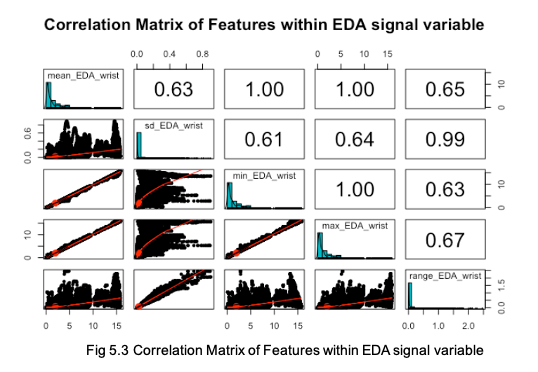

```{r, function checking for installed packages, include=FALSE}
# Validate that all necessary packaged have been downloaded, install otherwise or throw err package DNE
pkgTest <- function(x)
{
  if (!require(x,character.only = TRUE))
  {
    install.packages(x,repos = "http://cran.r-project.org", dep=TRUE)
    if(!require(x,character.only = TRUE)) stop("Package not found")
  }
}
```

```{r include=FALSE}
# Installing packages 
pkgTest("tidyverse")
pkgTest("knitr")
pkgTest("kableExtra")
pkgTest("caret")
pkgTest("randomForest")
pkgTest("MASS")
pkgTest("cvAUC")
pkgTest("car")
pkgTest("broom")
pkgTest("lme4")
pkgTest("cAIC4")
pkgTest("boot")
pkgTest("cvms")
pkgTest("grid")
pkgTest("gridExtra")
pkgTest("arm")
pkgTest("png")
```

```{r include=FALSE}
library(tidyverse)
library(knitr)
library(kableExtra)
library(caret)
library(randomForest)
library(MASS)
library(cvAUC)
library(car)
library(broom)
library(lme4)
library(cAIC4)
library(boot)
library(cvms)
library(grid)
library(gridExtra)
library(png)
knitr::opts_chunk$set(echo = FALSE,
                      message = FALSE,
                      warning = FALSE)
ggplot2::theme_set(new = theme_bw())
```

```{r load-data}
#survey <- read_csv("survey.csv")
final_data <- readRDS("final_data.Rds")
#sub_data <- readRDS("subj_df.Rds")
raw_data <- readRDS("chest_and_wrist.Rds")
# survey <- survey %>%
#   rename(label = Label)
# sub_data <- sub_data %>%
#   rename(participant = Participant) %>%
#   mutate(`Dominant hand` = as.factor(`Dominant hand`),
#          Gender = as.factor(Gender),
#          `Height (cm)` = as.double(`Height (cm)`),
#          `Weight (kg)` = as.double(`Weight (kg)`))
all_data <- final_data %>% 
  # left_join(survey, by=c("participant", "label")) %>% 
  #left_join(sub_data, by=c("participant")) %>% 
  filter(label != 1) %>% 
  mutate(label = case_when(
    label ==  2 ~ 1,
    label == 3 ~ 0
  )) %>% 
  mutate(label = as.factor(label)) %>% 
  mutate(participant = fct_relevel(participant,  c('S10', 'S2', 'S3', 'S4', 'S5', 'S6', 'S7', 'S8', 'S9', 'S11', 'S13', 'S14', 'S15', 'S16', 'S17'))) %>% 
  mutate_if(is.numeric, scale)
```


```{r train-test}
set.seed(20200922)
idx = createDataPartition(all_data$label, p = 0.8, list = FALSE)
train = all_data[idx, ]
test = all_data[-idx, ]
train_control <- trainControl(method="repeatedcv", number = 5, savePredictions = T) # this is the cross validation
```

```{r metrics}
round_perc = function(x) {
  if (is.double(x)) {
    round(x*100, digits = 2) 
  }
}

calc_metrics = function(model, testing_data, folds) {
  
  acc_list = c()
  f1_list = c()
  AUC_list = c()
  
  # metrics for cross validated data
  for (i in 1:folds) {
    fold <- model$pred %>% pull(Resample) %>% unique() %>% .[i]
    
    fold_df <- model$pred %>% 
      filter(Resample == fold)
    
    # accuracy
    acc <- mean(fold_df$pred == fold_df$obs)
    acc_list[i] <- acc
    
    # F1 score
    # precision <- posPredValue(fold_df$pred, fold_df$obs, positive="1")
    # recall <- sensitivity(fold_df$pred, fold_df$obs, positive="1")
    # F1 <- (2 * precision * recall) / (precision + recall)
    f1_list[i] <- (confusionMatrix(fold_df$pred, fold_df$obs))$byClass["F1"]
    
    # AUC
    AUC_list[i] <- cvAUC::AUC(fold_df$pred %>% as.double(), fold_df$obs %>% as.double())
  }
  
  acc_mean = acc_list %>% mean(na.rm=T) %>% round_perc()
  acc_sd = acc_list %>% sd(na.rm=T) %>% round_perc()
  f1_mean = f1_list %>% mean(na.rm=T)  %>% round_perc()
  f1_sd = f1_list %>% sd(na.rm=T)  %>% round_perc()
  AUC_mean = AUC_list %>% mean(na.rm=T)  %>% round_perc()
  AUC_sd = AUC_list %>% sd(na.rm=T)  %>% round_perc()
  
  # metrics for testing data
  pred <- predict(model, newdata = testing_data)
  test_acc <- mean(pred == testing_data %>% pull(label))
  
  cm <- confusionMatrix(as.factor(pred), testing_data$label)
  
  # precision <- posPredValue(pred, testing_data$label, positive="1")
  # recall <- sensitivity(pred, testing_data$label, positive="1")
  test_F1 <- cm$byClass["F1"]
  
  test_AUC <- cvAUC::AUC(pred %>% as.double(), testing_data$label %>% as.double())
  
  cv_df <- tibble(
    Accuracy = paste0(acc_mean, "% ± ", acc_sd, "%"),
    F1 = paste(f1_mean, "±", f1_sd),
    AUC = paste(AUC_mean, "±", AUC_sd)
  )
  
  test_df <- tibble(
    Accuracy = paste0(test_acc %>% round_perc(), "%"), 
    F1 = test_F1 %>% round_perc(),
    AUC = test_AUC %>% round_perc()
  )
  
  return(bind_cols(cv_df, test_df))
}
# returns accuracy/F1score/AUC if you run the model using the previous  code
```

# Introduction 

Affect recognition seeks to detect a person’s affective state. One of these states is stress, and long-term stress is known to have severe implications on human health and well-being [[1]][Bibliography]. With the rapid developments in wearable health technology, tracking various body metrics can allow to determine one's affective state. This study uses the Wearable Stress and Affect Detection (WESAD) dataset that contains both wrist and chest collected data, which was introduced in Schmidt et al. [[2]][Bibliography], and achieves classification accuracies of 86.2% on wrist data and 90.8% on all data (both chest and wrist) for the binary classification problem (stress vs. amusement). In conducting this analysis, we aim to determine whether sensor data are useful in predicting stress, and if so, which predictors are most significant when discriminating between stress and amusement. Furthermore, we seek to understand which types of sensor data are most useful in predicting stress, alone or in combination, and to determine if stress can be detected only using the wrist-worn wearable, which is more convenient to wear than a chest-worn device. Finally, we quantify the heterogeneity across individuals in their responses to stress.

# Literature Review

Stress can impact heart rate, blood pressure, and skin temperature [[3]][Bibliography]. When a threat is presented, it only takes the brain .9 milliseconds, or 1111 Hz, to shift a body into a full stress response [[4]][Bibliography]. In that time, the brain filters information relevant to our personal safety, redirects energy to only areas that are biologically relevant for survival, and releases stress hormones. While stress can be useful in some situations in that it activates fight-or-flight response and can help us during a dangerous situation, chronic stress can have many negative long-term impacts, even reducing brain mass in some cases.

However, stress is not the only emotion that impacts us physically. In fact, many of our physiological measures change based on our emotional state. L. Shu et. al. [[5]][Bibliography] examine how anger, anxiety, embarrassment, fear, amusement, happiness, and joy have different effects on our cardiovascular, electrodermal, respiratory, and electroencephalographic measures. Specifically, they saw that when patients are amused, heart rate becomes more variable and electrodermal activity, respiration rate and brain activity all increase. 

With more advanced technology these days, studies have shown that changes in emotion can be effectively measured by sensors of physiological data [[6]][Bibliography]. This study found that emotional valence and arousal could all be reliably estimated by using low-cost sensors used to collect data on electroencephalography (EEG), galvanic skin response (GSR), and electromyographic signal (EMG) data.

There has also been research done on the appropriate time intervals to use when measuring different body measures such as motion, respiration, electrodermal activity, and heart rate. Different studies use various sampling rates of the raw signals and window sizes for feature engineering, and it appears that there is no consensus on the best-suited way to choose these values. Arif and Kattan [[7]][Bibliography] used a five second rolling window to analyze ACC data, and Uy et. al. [[8]][Bibliography] also used a five second rolling window for measuring Galvanic Skin Response, Blood Volume Pulse, and Respiratory Variability. Since we found multiple sources using a five-second window for predictors similar to the ones in our dataset, we decided to use this approach as well. 

# Data 

```{r}
# includes all the plots in the EDA
EDA_wrist_eng_df <- all_data %>% dplyr::select(participant, label, mean_EDA_wrist:range_EDA_wrist) 

raw_data_mod <- raw_data[!(raw_data$Label==1),] %>% 
  mutate(Participant = fct_relevel(Participant,  c('S2', 'S3', 'S4', 'S5', 'S6', 'S7', 'S8', 'S9', 'S10',  'S11', 'S13', 'S14', 'S15', 'S16', 'S17'))) 

# chest EDA
chest_EDA <- raw_data_mod %>% 
  mutate(row = row_number()) %>% 
  mutate(Label = case_when(
    Label == 2 ~ "Stress", 
    Label == 3 ~ "Amusement"
  )) %>% 
  ggplot(aes(x = row, y = EDA, color = as.factor(Label))) + 
  geom_line() + 
  scale_x_discrete(labels = abbreviate) +
  labs(title = "Chest EDA vs Time by Participant", x="Time", y="EDA (RespiBAN)", color = "Label", caption = "Fig 1.1 Plot of RespiBAN (Chest) EDA samples collected over \n time by participant and label (2-stress, 3-amusement)") +
  theme(plot.title = element_text(hjust = 0.5), plot.caption = element_text(hjust = 0.5)) +
  facet_wrap(Participant~. ,  scales = "free")

# wrist EDA
wrist_EDA <- raw_data_mod %>% 
  mutate(row = row_number()) %>%  
  mutate(Label = case_when(
    Label == 2 ~ "Stress", 
    Label == 3 ~ "Amusement"
  )) %>% 
  ggplot(aes(x = row, y = EDA_wrist, color = as.factor(Label))) + 
  geom_line() + 
  scale_x_discrete(labels = abbreviate) +
  labs(title = "Wrist EDA vs Time by Participant", x="Time", y="EDA (E4)", color = "Label",caption = "Fig 1.2 Plot of E4 (Wrist) EDA samples collected over time by \n participant and label (2-stress, 3-amusement)") +
  theme(plot.title = element_text(hjust = 0.5), , plot.caption = element_text(hjust = 0.5)) +
  facet_wrap(Participant~. ,  scales = "free")

# ACC plots

peak_wrist_ACC_Z_plot <- ggplot(all_data %>% mutate(label = case_when(
  label == 1 ~ "Stress", 
  label == 0 ~ "Amusement"
))  , aes(peak_wrist_ACC_Z, color = as.factor(label))) + 
  geom_histogram(binwith=30) +
  labs(title = "Histogram of Peak Wrist ACC Z samples by Participant", y="Count",x = "Peak Wrist ACC Z", caption = "Fig 1.3 Histogram of peak acc wrist samples  \n by participant and label (2-stress, 3-amusement)", color = "Label") +
  theme(plot.title = element_text(hjust = 0.5), , plot.caption = element_text(hjust = 0.5)) +
  facet_wrap(~participant)

mean_ACC_chest_mag_plot <- ggplot(all_data%>% mutate(label = case_when(
  label == 1 ~ "Stress", 
  label == 0 ~ "Amusement"
)) , aes(mean_ACC_chest_mag, color = as.factor(label))) +
  geom_histogram(binwith=30) +
  labs(title = "Histogram of Mean ACC Chest Mag samples by Participant", y="Count", x = "Mean ACC Chest Mag", caption = "Fig 1.4 Histogram of mean acc chest \n magnitude samples by participant and label (2-stress, 3-amusement)", color = "Label") +
  theme(plot.title = element_text(hjust = 0.5), plot.caption = element_text(hjust = 0.5)) +
  facet_wrap(~participant)

panel.cor <- function(x, y, ...)
{
  par(usr = c(0, 1, 0, 1))
  txt <- as.character(format(cor(x, y), digits=2))
  text(0.5, 0.5, txt, cex = 6* abs(cor(x, y)))
}
```

The WESAD dataset [[2]][Bibliography] contains 63 million samples of raw physiological and motion signal data collected from 15 test subjects (12 male, 3 female) with ages between 24-35. The data was collected using 2 devices: a chest-worn device (RespiBAN) and a wrist-worn device (Empatica E4). The RespiBAN chest data includes electrocardiography (ECG) data in mV, electrodermal activity (EDA) in microseconds, electromyography (EMG) data in mV, skin temperature (TEMP) in °C, displacement of the thorax for males and the abdomen for females induced by inhaling or exhaling (RESP) as a percentage, and 3-axis accelerometer (ACC) data in g - the acceleration of gravity. All RespiBAN data were recorded at 700 Hz. The E4 wrist data collected includes blood volume pulse (BVP) data (64Hz), ACC data in units of 1/64g (32Hz), EDA in microseconds (4Hz), and TEMP in °C (4Hz). Each sample also references a label corresponding to the study protocol condition, with each label referring to a different condition (1-baseline, 2-stress, 3-amusement, 4-meditation). These conditions were recorded by having participants exposed to sources of stimulation that would elicit the desired condition. The labels 0, 5, 6, 7  indicate that the data should be ignored. The dataset also included information about each subject, such as height, weight and age, as well as personal responses to PANAS and SSSQ questionnaires. Considering the nature of the WESAD dataset and the scope of our study, we decided to filter out samples that did not represent stress or amusement.

Figure 1.1 and 1.2 show plots of the EDA signal data by participant and by condition showing different values when the participant experienced different conditions, and this difference is captured both in the chest and wrist data. Since we only took samples for 2 conditions, we could desirably observe a relative equal distribution of samples in both groups. However, raw signal data only provides limited information and difficult interpretability, and therefore from these raw data signals, we performed data and domain-driven feature engineering to generate potential predictor variables for our model that were easily interpretable and well represented the information in the data. We generated a total of 50 features across  all the raw signal variables.

```{r fig.width = 13,fig.height = 3.75}
gridExtra::grid.arrange(chest_EDA, wrist_EDA, ncol=2)
```

# Methodology

## Feature Engineering

As mentioned earlier, the brain takes .9 milliseconds to shift the body into a full stress response[[4]][Bibliography], which suggests that these data should be sampled at approximately 1111 Hz to properly identify a state of stress. However, the highest-resolution data is sampled at 700 Hz, which suggests that these data are not granular enough to fully capture a shift to stress. Furthermore, we extracted features at a higher precision but found no significant differences than ones extracted at 4Hz. As our study is focused on determining the stress detection over long periods of time and with computational cost in mind, we decided to downsample our data to 4Hz. We assigned a unique ID to each of the 15 subjects, and also added their personal characteristics. Since we are primarily interested in differentiating between stress and amusement, we only kept samples that were labeled 2 (stress) or 3 (amusement). We then relabeled amusement as 0 and stress as 1.   

Next, we calculated features for the different modalities.  Segmentation of the physiological signals was done using a sliding window, with a window shift of 0.25 seconds. The ACC and physiological features were all extracted using a 5 second window size [[7]][Bibliography][[8]][Bibliography]. To calculate some BVP and ECG features, we utilized peak detection algorithms [[9]][Bibliography] to identify the time between each successive peaks and used the peak intervals to calculate the mean, standard deviation and root-mean squared of heart rate variability within each assigned windows. 

To calculate the respiration variables, we had to separate out inhales and exhales. Inhale data corresponded to respiration values greater than zero and exhale data corresponded to respiration values less than zero. For five-second intervals where someone either did not inhale or exhale, we coded the corresponding observations to equal zero instead of NA. Additionally, we found total respiration range which took both inhale and exhale values into account when calculating the maximums and minimums. Next, we calculated the inhale to exhale ratio by dividing our mean inhale column by our mean exhale column. Since this would have produced some infinite values due to the fact that periods where someone was not exhaling were set to zero, we set these inhale/exhale ratios to equal 10. Additionally, we had a couple of intervals where the inhale/exhale ratio was very large, sometimes even greater than 1500. This was happening because some five-second windows in our data could have consisted of the participant inhaling for most of the time, thus we would be dividing by an extremely low exhale value. So, we re-coded any ratio greater than 10 to equal an upper bound of 10. This is a fair assumption, since it would not be physically possible for someone to inhale incredibly more than they exhale. We next calculated a breath rate by first summing the number of rows in one breath cycle, which is defined as one full inhale and one full exhale. Then, we took this sum and divided it by four, since the observations in our dataset were taken every quarter of a second, to get the time in seconds of one full breath cycle. 

For ACC, we also calculated the 3D magnitude, $ACC = \sqrt{ACC_X^2 + ACC_Y^2 + ACC_Z^2}$. We then calculated the mean, standard deviation, maximum, minimum and range of these modalities; a summary of all predictor variables is given in Table 1. 

```{r fig.width = 12,fig.height = 3.5}
gridExtra::grid.arrange(peak_wrist_ACC_Z_plot, mean_ACC_chest_mag_plot, ncol=2)
```

Performing exploratory data analysis on the engineered features provided more insightful information related to our study. For example, Figure 1.3 and 1.4 are histograms of Peak Wrist ACC Z and Mean ACC Chest Magnitude samples engineering from the raw signal ACC data. From these plots we can observe that these ACC feature values have different distributions based on the different conditions and could potentially be significant in predicting stress or amusement.

Other interesting insights like potential issues of multicollinearity were observed when plotting correlation matrices of the features. Figure 2 shows features engineered only from EDA and we can see that there exists a high level of collinearity. It is important to note that some correlation values are 1.00 due to the large size of our dataset and having the features engineered from the same signal variable. On the other hand, there was low correlation between features of different signal variables. High collinearity in predictor variables will influence the strategies and thresholds chosen for model selection and interaction effects, which we elaborate further in the paper in relation to our proposed model. 

```{r out.width="50%", fig.align= 'center'}

```

```{r}
features_tbl <- data.frame(
  Metric = c(rep("Chest ACC", 1), rep("Chest ECG", 1), rep("Chest EDA",2), rep("Chest EMG",2), rep("Chest Resp",5), "Chest Temp", 
             "Wrist ACC", "Wrist BVP", "Wrist EDA", "Wrist Temp"),
  
  Features = linebreak(c("Mean ($\\mu^C_{ACC}$), SD ($\\sigma^C_{ACC}$)", 
                         "Mean ($\\mu^C_{ECG}$), SD ($\\sigma^C_{ECG}$), Mean HRV ($\\mu^C_{HRV}$), SD HRV ($\\sigma^C_{HRV}$)", 
                         "Mean ($\\mu^C_{EDA}$), SD ($\\sigma^C_{EDA}$), Min ($Min^C_{EDA}$)", 
                         "Max ($Max^C_{EDA}$), Range ($Range^C_{EDA}$)", 
                         "Mean ($\\mu^C_{EMG}$), SD ($\\sigma^C_{EMG}$), Min ($Min^C_{EMG}$)", 
                         "Max ($Max^C_{EMG}$), Range ($Range^C_{EMG}$)", 
                         "Mean ($\\mu^C_{inhale}$), SD ($\\sigma^C_{inhale}$)", "Mean ($\\mu^C_{exhale}$), SD ($\\sigma^C_{exhale}$)",
                         "Min ($Min^C_{resp}$), Max ($Max^C_{resp}$), Range ($Range^C_{resp}$)", 
                         "Mean ($\\mu^C_{breath}$), SD ($\\sigma^C_{breath}$), Min ($Min^C_{breath}$)", 
                         "Max ($Max^C_{breath}$), Range ($Range^C_{breath}$), I/E Ratio", 
                         "Mean ($\\mu^C_{T}$), SD ($\\sigma^C_{T}$), Min ($Min^C_{T}$), Max ($Max^C_{T}$), Range ($Range^C_{T}$)", 
                         "Mean ($\\mu^W_{ACC}$), SD ($\\sigma^W_{ACC}$)", 
                         "Mean ($\\mu^W_{ECG}$), SD ($\\sigma^W_{ECG}$), Mean HRV ($\\mu^W_{HRV}$), SD HRV ($\\sigma^W_{HRV}$)", 
                         "Mean ($\\mu^W_{EDA}$), SD ($\\sigma^W_{EDA}$), Min ($Min^W_{EDA}$), Max ($Max^W_{EDA}$), Range ($Range^C_{EDA}$)", 
                         "Mean ($\\mu^W_{T}$), SD ($\\sigma^W_{T}$), Min ($Min^W_{T}$), Max ($Max^W_{T}$), Range ($Range^W_{T}$)")
  )
)
features_tbl %>% 
  kable(escape=F,   booktabs = T, align = "c",
        caption = "Summary of Sensor Data Categories, with the Extracted Predictors and Respective Symbols",) %>%
  kable_styling(latex_options = c("hold_position")) %>% 
  group_rows(index = c("Chest Sensor Data" = 12, "Wrist Sensor Data" = 4)) %>%
  collapse_rows(columns = 1, latex_hline = "major") %>% 
  row_spec(0, bold = TRUE) #%>% 
#column_spec(column = c(2), latex_column_spec = "c")
```

## Model Selection 

We first split our data into a 80/20 train/test split, perform 5-fold cross validation on the training data and lastly assess model performance by predicting on the testing data.The extracted features serve as predictors for our classification models. We propose two different models, both using different types of sensor data: features from the wrist-worn device, and features from both chest-worn and wrist-worn devices. Since our research goals are concerned with the predictive power and interpretability of our models, logistic regression was chosen over other classification algorithms. To determine our final model, we performed variable selection by first including all relevant features and $participant$ and then used backward selection with AIC as the selection criterion. We also tried forward selection and the BIC criterion, but ended up with similar models. Then, we iteratively removed variables that had p-values greater than 0.1. Interaction effects between the remaining predictors and with $participant$ were fit to determine if they would improve the predictive power of the models. We also noted that the models with the subjects’ personal characteristics did not increase accuracy, $F_1$-score or AUC values, and also led to increased computational cost. Thus, we did not include any personal characteristics in the final models. 

We also tried fitted multilevel logistic regression models, where $participant$ was the random effect. However, these models were computationally expensive, and did not improve the classification metrics. We also utilized the random forest algorithm; these models resulted in better predictions, but lack sufficient interpretation. Both of these algorithms are discussed in the Appendix.   

The final models are below (Model 1 was fitted using only the wrist-worn data and Model 2 was fitted using all the sensor data). $i$ corresponds to each sample, and $Y_i$ indicates the corresponding state (1 = stress or 0 = amusement). $subject_i$ represents the unique subject ID that was assigned to each of the 15 participants. The reference level for $subject$ is Subject 10 (S10), who had the highest number of samples in the filtered dataset. The remaining levels $j \in (2, 3, \dots, 14, 15)$ correspond to S2, S3, S4, S5, S6, S7, S8, S9, S11, S13, S14, S15, S16 and S17 respectively. The other predictors correspond to those displayed in Table 1.

$$
\begin{aligned}
&\ \ \ \  \ \ \ \ \ \ \ \ \ \ \ Y_i \sim  Bernoulli(\pi_i) \\
log(\frac{\pi_i}{1 - \pi_i}) = \beta_0 + \beta_1 \ \sigma^W_{i EDA} + &\beta_2 \ \sigma^W_{i ACC} + \beta_3 \ \sigma^W_{i HRV} \ + \beta_4 \ \sigma^W_{i EDA} * \sigma^W_{i HRV} \ + 
\beta_5 \ \sigma^W_{i EDA} * \sigma^W_{i ACC} \ + \\ 
\beta_6 \  \sigma^W_{i HRV} * \sigma^W_{i ACC} & \ + \sum_{j=2}^{15}\beta_{7j} \ I(subject_i = j) \ + \sum_{j=2}^{15} \beta_{8j} \  \sigma^W_{i ACC} * I(subject_i = j) & (1)
\end{aligned}
$$

$$
\begin{aligned}
& \,\,\,\,\,\,\, \,\,\,\,\,\,\,\,\,\,\,\,\,\, \, \, \, \, \, \, \, \,\,\,\,\,\,\, \, \, \, \, \, \, \, \, \, \, Y_i \sim  Bernoulli(\pi_i) \\
log(\frac{\pi_i}{1 - \pi_i}) = \beta_0 + &\beta_1 \ \mu^C_{i ACC} +  \beta_2 \ \sigma^C_{i ACC} +  \beta_3 \ \sigma^W_{i ACC} + \beta_4 \ \sigma^C_{i HR} + \beta_5 \ \sigma^W_{i HR} \ + \beta_6 \ \sigma^W_{i HRV} \ + \\
\beta_7 \ rms^C_{i HRV} + &\beta_8  \ rms^W_{i HRV} + \beta_9  \ \sigma^C_{i EDA} \ + \beta_{10} \ \sigma^W_{i EDA} + \beta_{11} \ min^C_{i EMG} +\beta_{12} \ \sigma_{i\ inhale} \ + \\
\beta_{13} \ \sigma_{i\ exhale}  + \beta_{i 14} \ &max_{i\ breath}  +  \beta_{15} \ ie_{i\ ratio} + \beta_{16} \ \sigma^C_{i T} +  \beta_{17} \ min^W_{i T} + \beta_{18} \ \sigma^C_{i EDA}  * min^W_{i T} \ + \\ 
\sum_{j=2}^{15} \beta_{19j} \ I(subject_i = j) & + \sum_{j=2}^{15} \beta_{20j}  \ rms^W_{i HRV} * I(subject_i = j) \ +\sum_{j=2}^{15} \beta_{21j}\ \sigma^C_{i HR} * I(subject_i = j) &(2)
\end{aligned}
$$

## Evaluation Metrics

We used accuracy, $F_1$-score, and AUC as evaluation metrics. Accuracy is the number of correctly classified observations over the total number of samples. We then define the $F_1$-score and AUC. The True Positive Rate (TPR/Recall) is the proportion of positive (stress) samples that are correctly identified. The False Positive Rate (FPR) is the proportion of negative (amusement) samples that are predicted to be positive over the total number of negative samples. Precision is the proportion of samples that are positive and classified as one over the total number of samples that are predicted to be positive. Thus, the $F_1$-score is the harmonic average of the precision and recall, and is a good choice for imbalanced classification tasks.  The Receiver Operating Characteristics (ROC) curve plots the TPR against the FPR. The AUC is thus the area under the ROC curve. Both the $F_1$-score and AUC have  a range of [0,1], where a higher value indicates better classification, and a value of 1 indicates perfect classification. 

# Results 

```{r logistic-regression-wrist}
lr_model_final_wrist <- train(label ~  sd_EDA_wrist + sd_ACC_wrist_mag + sd_heart_rate_variability_wrist_BVP + 
                                sd_EDA_wrist*sd_ACC_wrist_mag + sd_EDA_wrist*sd_heart_rate_variability_wrist_BVP + 
                                sd_ACC_wrist_mag*sd_heart_rate_variability_wrist_BVP + 
                                participant + participant:sd_ACC_wrist_mag,
                              data = train, trControl = train_control, 
                              method = "glm",
                              family ="binomial") 
naive_wrist <- lr_model_final_wrist$pred %>% 
  group_by(Resample, obs) %>% 
  summarize(count = n()) %>% 
  mutate(prop = count / sum(count)) %>% 
  filter(obs == 1) 
#summary(lr_model_final_wrist$finalModel)

#ggplot(data = all_data, aes(x = sd_EDA_wrist, color = label)) + geom_histogram() + facet_wrap(participant~., scales = "free")
``` 

```{r full-logistic-model}
lr_model_final_wrist_chest <- train(label ~ sd_EDA + sd_EDA_wrist + sd_Temp_chest + 
                                      min_Temp_wrist + min_EMG + sd_inhale + sd_exhale + max_breath + 
                                      i_e_ratio + mean_ACC_chest_mag + sd_ACC_chest_mag + sd_ACC_wrist_mag + 
                                      sd_heart_rate_wrist_BVP + sd_heart_rate_variability_wrist_BVP + rms_heart_rate_variability_wrist_BVP + 
                                      sd_heart_rate_chest_ECG + rms_heart_rate_variability_chest_ECG  + 
                                      sd_EDA_wrist * min_Temp_wrist + participant +
                                      rms_heart_rate_variability_wrist_BVP*participant + sd_heart_rate_chest_ECG*participant, # try different interactions 
                                    data = train, trControl = train_control, 
                                    method = "glm",
                                    family ="binomial")
naive_wrist_chest <- lr_model_final_wrist_chest$pred %>% 
  group_by(Resample, obs) %>% 
  summarize(count = n()) %>% 
  mutate(prop = count / sum(count)) %>% 
  filter(obs == 1) 

#exp(confint(lr_model_final_wrist_chest$finalModel))
```

```{r logistic-regression-metrics}
final_wrist_lr_model_df <- calc_metrics(lr_model_final_wrist, test, 5)  %>% 
  mutate(model = "Wrist Only")
final_wrist_chest_lr_model_df <- calc_metrics(lr_model_final_wrist_chest, test, 5) %>% 
  mutate(model = "Chest & Wrist")
bind_rows(final_wrist_lr_model_df, final_wrist_chest_lr_model_df) %>% 
  dplyr::select(model, everything()) %>% 
  kable(booktabs = T, align = "c",
        caption = "Model Results with 5-fold Cross Validation, with Mean and Standard Deviation reported",
        col.names = c("Model", "Accuracy", "F1-Score", "AUC", "Accuracy", "F1-Score", "AUC"
        )) %>% 
  kable_styling(latex_options = c("hold_position")) %>%
  add_header_above(c(" " = 1, "Cross Validation Data" = 3, "Test Data" = 3))
#vif(lr_model_final_wrist$finalModel) %>% kable()
```


## Wrist Sensor Data 

Using only data from the wrist-worn wearable, our model reports an accuracy of `r final_wrist_lr_model_df$Accuracy...4`, an $F_1$-score of `r final_wrist_lr_model_df$F1...5` and an AUC of `r final_wrist_lr_model_df$AUC...6` when predicting on the testing data. This suggests that we can detect stress vs. amusement reasonably well using only the wrist-worn wearable, which may be preferable since a wrist-worn device is minimally intrusive and more convenient than a chest-worn device. A naive classifier using only wrist sensor data that predicts only the majority class from each test fold reports an accuracy of 64.26 ± 0.00; this indicates our model exceeds that of a naive classifier. 

## All Sensor Data  

Using data from both the chest-worn and wrist-worn wearables, our model reports an accuracy of `r final_wrist_chest_lr_model_df$Accuracy...4`, an $F_1$-score of `r final_wrist_chest_lr_model_df$F1...5` and an AUC of `r final_wrist_chest_lr_model_df$AUC...6` when predicting on the testing data. These values suggest that sensor data are useful in discriminating between stress and amusement conditions. These metrics are slightly better than the previous model, which indicates that having data from both the chest-worn and wrist-worn wearables is better than having just data from the wrist-worn device. A naive classifier using all sensor data that predicts only the majority class from each test fold reports an accuracy of 64.26 ± 0.00; similarly, this indicates our model exceeds that of a naive classifier. 

## Model Diagnostics 

```{r full-logistic-model-diagnostics, fig.align="center", fig.width = 6, fig.height = 3}
#VIF values (measures multi-collinearity)
#vif(lr_model_final_wrist$finalModel)
#Sensitivity Analysis
table1 <- tidy(table(tibble("target" = test$label,
                            "prediction" = predict(lr_model_final_wrist, test))))
pcm1 <- plot_confusion_matrix(table1, 
                              add_row_percentages = FALSE,
                              add_col_percentages = FALSE,
                              targets_col = "target", 
                              predictions_col = "prediction",
                              counts_col = "n") + 
  ggplot2::labs(subtitle = "Wrist Data (Model 1)") + 
  ggplot2::theme(plot.subtitle = element_text(hjust = 0.5))
table2 <- tidy(table(tibble("target" = test$label,
                            "prediction" = predict(lr_model_final_wrist_chest, test))))
pcm2 <- plot_confusion_matrix(table2,   
                              #add_normalized = FALSE,
                              add_row_percentages = FALSE,
                              add_col_percentages = FALSE,
                              targets_col = "target", 
                              predictions_col = "prediction",
                              counts_col = "n") + 
  ggplot2::labs(subtitle = "Chest & Wrist Data (Model 2)") + 
  ggplot2::theme(plot.subtitle = element_text(hjust = 0.5))
gridExtra::grid.arrange(pcm1, pcm2, ncol=2, 
                        bottom = textGrob("Figure 3: Confusion Matrices on Model Predictive Accuracy for model trained on only  \n Wrist Data and Wrist and Chest data combined", gp = gpar(fontsize = 6)))
```

From the metrics displayed in Table 2 and the confusion matrices in Figure 3, it seems that both the wrist model and chest & wrist models have relatively high classification accuracies when detecting stress vs. amusement. 

It is also worth discussing independence when evaluating our logistic regression model.  Adding $participant$ addresses independence at the subject level, but each individual sample is not independent; presumably, a person's heart rate from one second ago affects their current heart rate. In addition, we display variance inflation factor (VIF) values for both our models in the Appendix in Tables 9-11. VIF quantifies the severity of multicollinearity in a logistic regression model, and a smaller VIF value indicates less multicollinearity. In general, most VIF values are below 10; however, $participant$ and predictors that are used in interaction effects may have higher VIF values. However, since the standard errors of our estimates and interaction effects are relatively small, the larger VIF values are acceptable. 

### Sensitivity Analysis 

```{r eval=FALSE}
train_1Hz <- train %>%
  slice(which(row_number() %% 4 == 1))
test_1Hz <- test %>%
  slice(which(row_number() %% 4 == 1))
lr_model_final_wrist_1Hz <- train(label ~ sd_EDA_wrist + sd_ACC_wrist_mag + sd_heart_rate_variability_wrist_BVP + 
                                    sd_EDA_wrist*sd_ACC_wrist_mag + sd_EDA_wrist*sd_heart_rate_variability_wrist_BVP + 
                                    sd_ACC_wrist_mag*sd_heart_rate_variability_wrist_BVP + 
                                    participant + participant:sd_ACC_wrist_mag,
                                  data = train_1Hz, trControl = train_control, 
                                  method = "glm",
                                  family ="binomial") 
lr_model_final_wrist_chest_1Hz <- train(label ~ sd_EDA + sd_EDA_wrist + sd_Temp_chest + 
                                          min_Temp_wrist + min_EMG + sd_inhale + sd_exhale + max_breath + 
                                          i_e_ratio + mean_ACC_chest_mag + sd_ACC_chest_mag + sd_ACC_wrist_mag + 
                                          sd_heart_rate_wrist_BVP + sd_heart_rate_variability_wrist_BVP + rms_heart_rate_variability_wrist_BVP + 
                                          sd_heart_rate_chest_ECG + rms_heart_rate_variability_chest_ECG  + 
                                          sd_EDA_wrist * min_Temp_wrist + participant +
                                          rms_heart_rate_variability_wrist_BVP*participant + sd_heart_rate_chest_ECG*participant, # try different interactions 
                                        data = train_1Hz, trControl = train_control, 
                                        method = "glm",
                                        family ="binomial")


# summary(lr_model_final_wrist_chest$finalModel) %>% coef() %>% as.data.frame() %>% tibble::rownames_to_column() %>% 
#   left_join(summary(lr_model_final_wrist_chest_1Hz$finalModel) %>% coef() %>% as.data.frame() %>% tibble::rownames_to_column(), by = "rowname") %>% 
#   mutate(diff = Estimate.x - Estimate.y) %>% 
#   pull(diff) %>% quantile()
# 
# 
# summary(lr_model_final_wrist$finalModel) %>% coef() %>% as.data.frame() %>% tibble::rownames_to_column() %>% 
#   left_join(summary(lr_model_final_wrist_1Hz$finalModel) %>% coef() %>% as.data.frame() %>% tibble::rownames_to_column(), by = "rowname") %>% 
#   mutate(diff = Estimate.x - Estimate.y) %>% 
#   pull(diff) %>% quantile()
```

```{r eval=FALSE}
final_wrist_lr_model_df_1Hz <- calc_metrics(lr_model_final_wrist_1Hz, test_1Hz, 5) %>% 
  mutate(model = "Wrist Only (Model 3)")
final_wrist_chest_lr_model_df_1Hz <- calc_metrics(lr_model_final_wrist_chest_1Hz, test_1Hz, 5) %>% 
  mutate(model = "Chest & Wrist (Model 4)")
```


```{r eval=FALSE}
bind_rows(final_wrist_lr_model_df_1Hz, final_wrist_chest_lr_model_df_1Hz) %>% 
  dplyr::select(model, everything()) %>% 
  kable( booktabs = T,  align = "c",
         caption = "Model Results with Data Sampled at 1 Hz",
         col.names = c("Model", "Accuracy", "F1-Score", "AUC", "Accuracy", "F1-Score", "AUC"
         )) %>% 
  kable_styling(latex_options = c("hold_position")) %>%
  add_header_above(c(" " = 1, "Cross Validation Data" = 3, "Test Data" = 3), escape = F)
#vif(lr_model_final_wrist$finalModel) %>% kable()
```

```{r resid-plots}

# aug_wrist <- augment(lr_model_final_wrist$finalModel, type.predict = "response", 
#                      type.residuals = "deviance")
# 
# p1 <- arm::binnedplot(x=aug_wrist$.fitted,y=aug_wrist$.resid,xlab="Predicted Probabilities", 
#                 main = "Binned Residual vs. Predicted Values")
# 
# aug_chest_wrist <- augment(lr_model_final_wrist_chest$finalModel, type.predict = "response", 
#                      type.residuals = "deviance")
# 
# p2 <- arm::binnedplot(x=aug_chest_wrist$.fitted,y=aug_chest_wrist$.resid,xlab="Predicted Probabilities", 
#                 main = "Binned Residual vs. Predicted Values")
# 
# plot_grid(p1, p2, ncol = 2, nrow = 1)
```


```{r}
final_data_60_window <- readRDS("final_data_60s_window.Rds") %>% 
  filter(label != 1) %>% 
  mutate(label = case_when(
    label ==  2 ~ 1,
    label == 3 ~ 0
  )) %>% 
  mutate(label = as.factor(label)) %>% 
  mutate(participant = fct_relevel(participant,  c('S10', 'S2', 'S3', 'S4', 'S5', 'S6', 'S7', 'S8', 'S9', 'S11', 'S13', 'S14', 'S15', 'S16', 'S17'))) %>% 
  mutate_if(is.numeric, scale)
set.seed(20200922)
idx = createDataPartition(final_data_60_window$label, p = 0.8, list = FALSE)
train_60window = final_data_60_window[idx, ]
test_60window = final_data_60_window[-idx, ]
train_control <- trainControl(method="repeatedcv", number = 5, savePredictions = T) # this is the cross validation

lr_model_final_wrist_60window <- train(label ~ sd_EDA_wrist + sd_ACC_wrist_mag + sd_heart_rate_variability_wrist_BVP + 
                                         sd_EDA_wrist*sd_ACC_wrist_mag + sd_EDA_wrist*sd_heart_rate_variability_wrist_BVP + 
                                         sd_ACC_wrist_mag*sd_heart_rate_variability_wrist_BVP + 
                                         participant + participant:sd_ACC_wrist_mag,
                                       data = train_60window, trControl = train_control, 
                                       method = "glm",
                                       family ="binomial") 
lr_model_final_wrist_chest_60window <- train(label ~ participant + sd_EDA + sd_EDA_wrist + sd_Temp_chest + 
                                               min_Temp_wrist + min_EMG + sd_inhale + sd_exhale + max_breath + 
                                               i_e_ratio + mean_ACC_chest_mag + sd_ACC_chest_mag + sd_ACC_wrist_mag + 
                                               sd_heart_rate_wrist_BVP + sd_heart_rate_variability_wrist_BVP + rms_heart_rate_variability_wrist_BVP + 
                                               sd_heart_rate_chest_ECG + rms_heart_rate_variability_chest_ECG + 
                                               # rms_heart_rate_variability_wrist_BVP*participant + sd_heart_rate_chest_ECG*participant + 
                                               sd_EDA_wrist * min_Temp_wrist,
                                             data = train_60window, trControl = train_control, 
                                             method = "glm",
                                             family ="binomial")

# summary(lr_model_final_wrist_chest$finalModel) %>% coef() %>% as.data.frame() %>% tibble::rownames_to_column() %>% 
#   left_join(summary(lr_model_final_wrist_chest_60window$finalModel) %>% coef() %>% as.data.frame() %>% tibble::rownames_to_column(), by = "rowname") %>% 
#   mutate(diff = Estimate.x - Estimate.y) %>% 
#   pull(diff) %>% quantile(na.rm=T)
# 
# summary(lr_model_final_wrist$finalModel) %>% coef() %>% as.data.frame() %>% tibble::rownames_to_column() %>% 
#   left_join(summary(lr_model_final_wrist_60window$finalModel) %>% coef() %>% as.data.frame() %>% tibble::rownames_to_column(), by = "rowname") %>% 
#   mutate(diff = Estimate.x - Estimate.y) %>% 
#   pull(diff) %>% quantile(na.rm=T)
```


```{r}
bind_rows(#final_wrist_lr_model_df_1Hz, 
  #final_wrist_chest_lr_model_df_1Hz,
  calc_metrics(lr_model_final_wrist_60window, test_60window, 5) %>% 
    mutate(model = "Wrist Only (Model 3)"), 
  calc_metrics(lr_model_final_wrist_chest_60window, test_60window, 5) %>% 
    mutate(model = "Chest & Wrist (Model 4)")) %>% 
  dplyr::select(model, everything()) %>% 
  kable( booktabs = T,  align = "c",
         caption = "Model Results with Data Sampled using 60s window size and 0.25s window shift",
         col.names = c("Model", "Accuracy", "F1-Score", "AUC", "Accuracy", "F1-Score", "AUC"
         )) %>% 
  kable_styling(latex_options = c("hold_position")) %>%
  add_header_above(c(" " = 1, "Cross Validation Data" = 3, "Test Data" = 3), escape = F)
```

Table 3 displays the results of the wrist data and all data models (Models 3 and 4), with the same predictors as Models 1 and 2, when using data that was sampled using a 60 second window size and a 0.25 second window shift (as compared to a 5 second window size and 0.25 second window shift). In general, this set of models performed better in terms of evaluation metrics. Similarly, we compare the estimates from this set of models to the estimates from our original models; these estimates are displayed in Tables 7 and 8 in the Appendix. Our wrist-only model appears to be reasonably robust, as most estimates using data sampled using a 60 second window size and a 0.25 second window shift were similar to the estimates from Model 1. However, the combined data model was less robust, as there are estimates, such as the one for the standard deviations of chest EDA that were quite different (1.12 vs. 2.36 for Model 2 vs. Model 4). This disparity could be due to the loss of data when sampling using a 60 second window, the choice to initially downsample our data to 4Hz or other external factors that these features could not capture in these models.

### Comparison to Other Models

In addition to our logistic regressions, we also ran a random forest model on the data. In our wrist-only random forest model, we found that min wrist EDA, max wrist EDA, range of wrist EDA and standard deviation of Z wrist ACC were the only significant predictors. While we don't see these exact predictors in our logistic regression, we had standard deviation of wrist EDA and standard deviation of wrist ACC in our final model, and these variables are highly correlated with the ones in our random forest model. 
For the model built with chest and wrist data, we saw that max wrist EDA and standard deviation of chest ACC were the only two important predictors outside of participant. Standard deviation of chest ACC also occurs in our logistic regression, however instead of max wrist EDA, we see standard deviation of wrist EDA. Again, these two variables are highly correlated, so that seems to make sense. Further discussion of our random forests models can be found in the appendix. 

# Discussion

## Interpretation of Wrist-Only Model

When standard deviation of wrist EDA increases by 1, we expect the odds of being stressed versus amused to multiply by a factor of `r round(exp(3.826), 3)` (with 95% CI `r round(exp(3.6888), 3)`, `r round(exp(3.9632), 3)`), holding all else constant. 
When standard deviation of wrist ACC increases by 1, we expect the odds of being stressed versus amused to multiply by a factor of `r round(exp(0.445), 3)` (`r round(exp(2.76076), 3)`, `r round(exp(4.59924), 3)`), holding all else constant. 
When standard deviation of wrist HRV increases by 1, we expect the odds of being stressed versus amused to multiply by a factor of `r round(exp(4.027), 3)` (`r round(exp(0.3568), 3)`, `r round(exp(0.5332), 3)`), holding all else constant. 


Holding standard deviation of wrist HRV constant, when standard deviation of wrist EDA and wrist ACC both increase by 1, we expect the odds of being stressed versus amused to multiply by an additional factor of `r round(exp(-1.129), 3)` (`r round(exp(-1.18976), 3)`,  `r round(exp(-1.06824), 3)`).
Holding standard deviation of wrist ACC constant, when standard deviation of wrist EDA and wrist HRV both increase by 1, we expect the odds of being stressed versus amused to multiply by an additional factor of `r round(exp(0.5), 3)` (`r round(exp(0.33732), 3)`,  `r round(exp(0.66268), 3)`).
Holding standard deviation of wrist EDA constant, when standard deviation of wrist HRV and wrist ACC both increase by 1, we expect the odds of being stressed versus amused to multiply by an additional factor of `r round(exp(0.253), 3)` (`r round(exp(0.11188), 3)`,  `r round(exp(0.39412), 3)`).


## Interpretation of Chest and Wrist Model

When standard deviation of chest EDA increases by 1, we expect the odds of being stressed versus amused to multiply by a factor of `r round(exp(1.198), 3)` (`r round(exp(1.08432), 3)`, `r round(exp(1.31168), 3)`), holding all else constant. 
When standard deviation of wrist EDA increases by 1, we expect the odds of being stressed versus amused to multiply by a factor of `r round(exp(8.779), 3)` (`r round(exp(8.48892), 3)`, `r round(exp(9.06908), 3)`), holding all else constant. 
When standard deviation of chest temperature increases by 1, we expect the odds of being stressed versus amused to multiply by a factor of `r round(exp(0.171), 3)` (`r round(exp(0.13376), 3)`, `r round(exp(0.20824), 3)`), holding all else constant. 
When minimum wrist temperature increases by 1, we expect the odds of being stressed versus amused to multiply by a factor of `r round(exp(-1.801), 3)` (`r round(exp(-1.899), 3)`, `r round(exp(-1.703), 3)`), holding all else constant. 
When minimum chest EMG increases by 1, we expect the odds of being stressed versus amused to multiply by a factor of `r round(exp(-0.143), 3)` (`r round(exp(-0.18416), 3)`, `r round(exp(-0.10184), 3)`), holding all else constant.
When standard deviation of inhale increases by 1, we expect the odds of being stressed versus amused to multiply by a factor of `r round(exp(0.573), 3)` (`r round(exp(0.52204), 3)`, `r round(exp(0.62396), 3)`), holding all else constant.
When standard deviation of exhale increases by 1, we expect the odds of being stressed versus amused to multiply by a factor of `r round(exp(-0.266), 3)` (`r round(exp(-0.30716), 3)`, `r round(exp(-0.22484), 3)`), holding all else constant.
When maximum breath cycle time increases by 1, we expect the odds of being stressed versus amused to multiply by a factor of `r round(exp(0.66932), 3)` (`r round(exp(0.636), 3)`, `r round(exp(0.60268), 3)`), holding all else constant.
When inhale/exhale ratio increases by 1, we expect the odds of being stressed versus amused to multiply by a factor of `r round(exp(-0.289), 3)` (`r round(exp(-0.32624), 3)`, `r round(exp(-0.25176), 3)`), holding all else constant.
When mean chest ACC increases by 1, we expect the odds of being stressed versus amused to multiply by a factor of `r round(exp(0.039), 3)` (`r round(exp(-0.01), 3)`, `r round(exp(0.088), 3)`), holding all else constant.
When standard deviation of chest ACC increases by 1, we expect the odds of being stressed versus amused to multiply by a factor of `r round(exp(0.802), 3)` (`r round(exp(0.74712), 3)`, `r round(exp(0.85688), 3)`), holding all else constant.
When standard deviation of wrist ACC increases by 1, we expect the odds of being stressed versus amused to multiply by a factor of `r round(exp(0.388), 3)` (`r round(exp(0.31744), 3)`, `r round(exp(0.45856), 3)`), holding all else constant.
When standard deviation of wrist HR increases by 1, we expect the odds of being stressed versus amused to multiply by a factor of `r round(exp(0.209), 3)` (`r round(exp(0.16196), 3)`, `r round(exp(0.25604), 3)`), holding all else constant.
When standard deviation of wrist HRV increases by 1, we expect the odds of being stressed versus amused to multiply by a factor of `r round(exp(0.173), 3)` (`r round(exp(0.1338), 3)`, `r round(exp(0.2122), 3)`), holding all else constant.
When root mean square of wrist HRV increases by 1, we expect the odds of being stressed versus amused to multiply by a factor of `r round(exp(0.282), 3)` (`r round(exp(0.17028), 3)`, `r round(exp(0.39371), 3)`), holding all else constant.
When standard deviation of chest HR increases by 1, we expect the odds of being stressed versus amused to multiply by a factor of `r round(exp(-0.74), 3)` (`r round(exp(-0.9262), 3)`, `r round(exp(-0.5538), 3)`), holding all else constant.
When standard deviation of chest HR increases by 1, we expect the odds of being stressed versus amused to multiply by a factor of `r round(exp(0.061), 3)` (`r round(exp(0.0218), 3)`, `r round(exp(0.1002), 3)`), holding all else constant.


Additionally, holding all else constant, when standard deviation of wrist HRV and minimum wrist temperature both increase by 1, we expect the odds of being stressed versus amused multiply by an additional factor of `r round(exp(-4.665), 3)` (`r round(exp(-4.8218), 3)`, `r round(exp(-4.5082), 3)`).

It is also interesting to note that in the model built with chest and wrist data, most of our predictors appear to be standard deviation measures, and in the wrist-only model, participant is the only non-standard deviation predictor. This observation suggests that the variability in physiological signals is a more important distinguisher of stress and amusement as opposed to the mean or maximum of these signals in many cases. 

## Quantifying Heterogeneity 

Please see Figures 3.1-3.5 in the Appendix for a graphical view of the Confidence Intervals for participant and participant interaction effects relative to our baseline of Subject 10. These estimates are graphed in terms of the log-odds for scaling reasons, however, you can see all of these intervals in terms of odds in Tables 7 and 8 in the Appendix.  

For the wrist only model, we see that Subjects 2, 3, 4, 6, 8, 11, 15, 16, and 17 are all less likely to be stressed if physiological measures are at the mean for the dataset than Subject 10. However, all of these intervals overlap except for those of Subjects 6 and 13, indicating that the other subjects don't differ significantly from each other. Additionally, Subject 14's log-odds of being stressed do not differ from Subject 10, and Subjects 5, 7, and 9 all appear to have greater odds of being stressed than Participant 10, and these three people differ significantly from each other. 

The interaction effect between participant and standard deviation of ACC appears to be significantly higher for Subjects 5 and 7 compared to the baseline of Subject 10. Subjects 9 and 14's high positive estimates also indicate that as standard deviation of ACC increases, their log-odds of being stressed increase at a greater rate than we see for the baseline Subject 10, however these estimates appear not to be significant. For the remaining subjects (2, 3, 4, 6, 8, 11, 13, 15, 16, and 17), their log-odds of being stressed decrease at a greater rate as standard deviation of ACC increases compared to Subject 10, however their confidence intervals all overlap, so they don't appear to differ significantly from each other. 

In the chest and wrist model, Subjects 17 and 9 have significantly greater log-odds of being stressed compared to Subject 10 when all other variables are at their mean. Subjects 2, 14, and 15 do not differ significantly from Subject 10. Subjects 3, 4, 5, 6, 7, 8, 11, 13, and 16 all have significantly lower log-odds of being stressed compared to Subject 10, but they don't all differ significantly from each other. Subjects 6 and 13 have the lowest log-odds, followed by Subjects 7 and 11, Subjects 3, 4, and 5, and finally subjects 8 and 16.

For the interaction effect between participant and root mean square wrist HRV, as root mean square HRV increases, Subject 11's log-odds of being stressed increase more compared to the baseline Subject 10, and Subject 3's log-odds also significantly increase more, although not by as much as Subject 11. Subjects 4 and 16 do not appear to have a significant difference in the impact on stress as root mean square HRV increases compared to Subject 10. We expect Subjects 2, 5, 6, 8, 9, and 14 all to have a decrease in log-odds of being stressed as root mean square HRV increases compared to Subject 10, however these subjects do not seem to vary significantly between each other. Lastly, Subjects 7, 13, 15, and 17 all see an even greater decrease in log-odds of being stressed as root mean square HRV increases compared 2, 5, 6, 8, 9, and 14, but again, and Subject 7 varies significantly from Subjects 15 and 17, but not 13.

Lastly, for the interaction effect between participant and standard deviation of chest HR, Subject 8 is the only subject whose log-odds of being stressed decrease as sd HR increases, relative to Subject 10. Subjects 2 and 5 do not have significantly differing effects of sd chest HR on the log-odds of being stressed compared to Subject 10. The remaining Subjects (9, 7, 6, 4, 3, 17, 16, 15, 14, 13, and 11) all have increasing log-odds of being stressed as sd HR increases compared to Subject 10, however not all of them significantly differ from each other. Subject 11 is significantly higher than all of the other subjects, and Subject 17 significantly differs from Subjects 3, 7, 9, 14, 15, and 16. 

Although some variation between subjects is expected, within both models, we see large variability among the odds of being stressed. These results indicate that there is heterogeneity across individuals’ responses to stress vs. amusement. Overall, although we only see the differences between S10 vs. other subjects (but not S2 vs. S3 for example), the disparity in the odds of being stressed across the 15 participants is pretty apparent. This could also be due to model instability or a small number of participants - a larger pool of participants could reduce heterogeneity and variability between the estimates. 

# Conclusion 

While we were able to distinguish between stress and amusement conditions fairly well with our model, it is worth pointing out some limitations. First, we only had data for the 15 participants that have similar ages and are mostly male. As participant ID is an important predictor in our models, we are unable to generalize the likelihood of being stressed or amused to other age groups or identified genders. Also, since all of the data was collected in one sitting during an experiment, our data is very highly correlated and  suggests there is heterogeneity across individuals’ responses to stress vs. amusement. We can distinguish between stress and amusement in this controlled laboratory setting, but we are unable to generalize the differences in these emotions in a person's day-to-day life, or what stress and amusement might even look like if the measurements were taken on a different day.

Since it appears that the wrist wearable is sufficient for detecting stress versus amusement in the laboratory setting, further research could study wrist data for individuals over a long time period, perhaps a day or even a week, and see if different emotions are still distinguishable. Also, studies could be done with a larger random sample of individuals to try and see if there are any findings about stressed versus amused physiological responses generalizable to all individuals instead of just at the participant level. 

# Appendix

## Bibliography

1. D. Watson, L. A. Clark and A. Tellegen. (1988). Development and validation of brief measures of positive and negative affect: the PANAS scales. Journal of Personality and Social Psychology, 54, 6, 1063.

2. P. Schmidt et al. (2018). Introducing WESAD, a Multimodal Dataset for Wearable Stress and Affect Detection. Proceedings of the 2018 on International Conference on Multimodal Interaction - ICMI 18.

3. H. Yaribeygi et al. (2017). The impact of stress on body function: A review. EXCLI Journal, 2017, 16, pp. 1057–1072.

4. D. Strickland. (2019). .9 Milliseconds. Transitions.

5. L. Shu et al. (2018). A Review of Emotion Recognition Using Physiological Signals. Sensors (Basel), 18, 7.

6. D. Girardi et al. (2017). Emotion Detection Using Noninvasive Low Cost Sensors

7. M. Arif and A. Kattan. (2015). Physical Activities Monitoring Using Wearable Acceleration Sensors Attached to the Body. PLoS ONE 10, 7.

8. G. Uy et al. (2013). Correlation of Stress Inducers and Physiological Signals with Continuous Stress Annotations. WCTP 2012, PICT 7, pp. 178–183.

9. P.Westermark (2015). Package ‘peakPick’. https://cran.r-project.org/web/packages/peakPick/peakPick.pdf


## Random Forest Model

```{r random-forests, eval=FALSE}
set.seed(20200922)
# forest_data <- all_data %>% 
#   subset(dplyr::select(-c(PANAS_Angry, PANAS_Irritated, SSSQ_Committed, SSSQ_Succeed, SSSQ_Motivated, SSSQ_Reflected, SSSQ_Concerned, SSSQ_Worried, Condition, PANAS_Sad)))
forest_data <- all_data
# forest_data <- forest_data[1:(length(forest_data)-1)]
# forest_data <- forest_data %>%
#   mutate(participant = as.factor(participant),
#          Age = as.numeric(Age),
#          Hand = as.factor(`Dominant hand`),
#          Gender = as.factor(Gender),
#          Height = as.numeric(`Height (cm)`),
#          Weight = as.numeric(`Weight (kg)`))
# forest_data <- forest_data %>% 
#   subset(dplyr::select = -c(`Dominant hand`, `Height (cm)`, `Weight (kg)`))
idx = createDataPartition(forest_data$label, p = 0.8, list = FALSE)
train = forest_data[idx, ]
test = forest_data[-idx, ]
# correlationMatrix <- cor(subset(forest_data, dplyr::select(-c(participant, label))))
# highlyCorrelated <- findCorrelation(correlationMatrix, cutoff=0.5, verbose = FALSE)
require(caTools)

sparse_no_survey_rf <- randomForest(
  label ~ participant +  max_EDA_wrist + sd_ACC_chest_mag, data=train)
round(importance(sparse_no_survey_rf), 2)
pred = predict(sparse_no_survey_rf, newdata=test)
cm=table(test$label, pred)
cm
misclass_rate = (64+27)/(4339+64+27+7888)
misclass_rate

wrist_rf <- randomForest(
  label ~ participant + min_EDA_wrist + max_EDA_wrist + range_EDA_wrist + sd_wrist_ACC_Z, data=train)
round(importance(wrist_rf), 2)
pred = predict(wrist_rf, newdata=test)
cm=table(test$label, pred)
cm
misclass_rate = (5+20)/(4398+5+20+7895)
misclass_rate
```

```{r cv-random-forest,  eval=FALSE}
if (file.exists('sparse_no_survey_rf')) {
  load(file = 'sparse_no_survey_rf')
} else {
  sparse_no_survey_rf <- train(
    label ~ participant +  max_EDA_wrist + sd_ACC_chest_mag, data=train,
    trControl = train_control, method = "rf"
  )
  save(sparse_no_survey_rf, file = 'sparse_no_survey_rf')
}
calc_metrics(sparse_no_survey_rf, test, 5)
if (file.exists('wrist_rf')) {
  load(file = 'wrist_rf')
} else {
  wrist_rf <- train(
    label ~ participant + min_EDA_wrist + max_EDA_wrist + range_EDA_wrist + sd_wrist_ACC_Z, data=train,
    trControl = train_control, method = "rf")
  save(sparse_no_survey_rf, file = 'wrist_rf')
}
calc_metrics(wrist_rf, test, 5)
```

In addition to the logistic regression, we also fit several other types of models. The first of those was a random forest model. We built a random forest model using all of our data and just the wrist data, and had great overall performance for both. Our model built with all the data consisted of only three predictors: participant ID, max wrist electrodermal activity, and magnitude of standard deviation of chest movement, and it had a misclassification rate of 0.74%. The model built using only wrist data used five predictors, which included participant ID, minimum electrodermal activity, maximum electrodermal activity, the range of electrodermal activity, and standard deviation of Z-plane movement, and it had an even lower misclassification rate of 0.002%. 

Despite the great performance of these models, we opted to go with the logistic regression as our final model since interpretability was important to the goals of the case study. Random forest is great for prediction, however it is difficult to interpret how exactly the predictors affect the response. Therefore, we were willing to sacrifice a little bit of accuracy in order to make more concrete conclusions about how our predictor variables affected stress and amusement.

```{r rf-using-same-preds-as-wrist-log-model, eval=FALSE}
rf_model_final_wrist <- train(label ~ participant + sd_EDA_wrist + sd_ACC_wrist_mag + 
                                sd_heart_rate_variability_wrist_BVP + participant:sd_ACC_wrist_mag + sd_EDA_wrist*sd_ACC_wrist_mag + sd_EDA_wrist*sd_heart_rate_variability_wrist_BVP + sd_ACC_wrist_mag*sd_heart_rate_variability_wrist_BVP,
                              data = newtrain, trControl = train_control,
                              method = "rf", tuneGrid = expand.grid(.mtry=floor(sqrt(34))))
save(rf_model_final_wrist, file = 'rf_model_final_wrist')
summary(rf_model_final_wrist$finalModel)
calc_metrics(rf_model_final_wrist, test, 5)
varImp(rf_model_final_wrist$finalModel)
```

## Multilevel Model

Another method we tried was using a multilevel model (MLM) with the features engineered from the raw signal data being the random effects of the model, while survey and participant-specific data as the fixed effects. One large issue with running MLM was the computational intensity it took after including more than 2 fixed effects and 4 random effects. Considering the number of predictor variables we wished to include and analyze, we decided that it was not feasible to run a multi-level model due to the nature of our study and dataset having a large number of samples and predictor variables.

```{r Hierarchal Model, eval=FALSE}
# Fixed Effects (survey & subdata variables)
survey_var<- paste(colnames(survey))
sub_var <- paste(colnames(sub_data))
fixed_var <- c(survey_var, sub_var)
fixed_var <- fixed_var[-c(2,37:42)] # removed missing SSSQ variables because of NA
# Random Effects (wearable variables)
wearable_var <- paste ("(1|",colnames(final_data)[-c(1,2)], ")")
# Formula
mlm_formula <- as.formula(paste("as.numeric(label) ~ participant + ", paste(wearable_var[c(9,50)], collapse= "+")))
mlm <- lmer(mlm_formula, data = train, REML=FALSE,control = lmerControl(check.nobs.vs.nlev = "ignore", check.nobs.vs.rankZ = "ignore", check.nobs.vs.nRE="ignore", optimizer ="Nelder_Mead", ))
summary(mlm)
stepAIC(mlm, direction = "backward", trace = TRUE, data = train)
```

## Heterogeneity Plots

```{r calculate-CIs, fig.align="center"}
lr_model_final_wrist_coef_tidy_df <- lr_model_final_wrist$finalModel %>% 
  tidy() %>%
  dplyr::select(-statistic) %>% 
  bind_rows(tibble(term = c("S10", "$\\sigma^W_{ACC}$ * S10"), 
                   estimate = c(0,0), `std.error` = c(0,0), `p.value`= c(0,0))) 
reordered_terms_wrist <- c("(Intercept)", "sd_EDA_wrist", "sd_ACC_wrist_mag",  
                           "sd_heart_rate_variability_wrist_BVP", "`sd_EDA_wrist:sd_ACC_wrist_mag`",
                           "`sd_EDA_wrist:sd_heart_rate_variability_wrist_BVP`",
                           "`sd_ACC_wrist_mag:sd_heart_rate_variability_wrist_BVP`",
                           "S10", 
                           "participantS2", "participantS3", "participantS4","participantS5", "participantS6",
                           "participantS7","participantS8","participantS9","participantS11","participantS13",
                           "participantS14","participantS15","participantS16","participantS17",
                           "$\\sigma^W_{ACC}$ * S10",
                           "`sd_ACC_wrist_mag:participantS2`", "`sd_ACC_wrist_mag:participantS3`",
                           "`sd_ACC_wrist_mag:participantS4`","`sd_ACC_wrist_mag:participantS5`",
                           "`sd_ACC_wrist_mag:participantS6`","`sd_ACC_wrist_mag:participantS7`",
                           "`sd_ACC_wrist_mag:participantS8`","`sd_ACC_wrist_mag:participantS9`",
                           "`sd_ACC_wrist_mag:participantS11`","`sd_ACC_wrist_mag:participantS13`",
                           "`sd_ACC_wrist_mag:participantS14`","`sd_ACC_wrist_mag:participantS15`",
                           "`sd_ACC_wrist_mag:participantS16`","`sd_ACC_wrist_mag:participantS17`"
                           
)

lr_model_final_wrist_chest_coef_tidy_df <- lr_model_final_wrist_chest$finalModel %>% 
  tidy() %>%
  dplyr::select(-statistic) %>% 
  bind_rows(tibble(term = c("S10", "$rms^W_{HRV}$ * S10", "$\\sigma^C_{HR}$ * S10"), 
                   estimate = c(0,0,0), `std.error` = c(0,0,0), `p.value`= c(0,0,0))) 
reordered_terms_wrist_chest <- c("(Intercept)", "sd_EDA" , "sd_EDA_wrist", "sd_Temp_chest" , 
                                 "min_Temp_wrist" , "min_EMG" , "sd_inhale" , "sd_exhale" , "max_breath" , "i_e_ratio" , "mean_ACC_chest_mag" ,
                                 "sd_ACC_chest_mag" , "sd_ACC_wrist_mag" , 
                                 "sd_heart_rate_wrist_BVP" , "sd_heart_rate_variability_wrist_BVP" , "rms_heart_rate_variability_wrist_BVP",
                                 "sd_heart_rate_chest_ECG" , "rms_heart_rate_variability_chest_ECG",
                                 "`sd_EDA_wrist:min_Temp_wrist`",
                                 "S10", 
                                 "participantS2", "participantS3", "participantS4","participantS5", "participantS6",
                                 "participantS7","participantS8","participantS9","participantS11","participantS13",
                                 "participantS14","participantS15","participantS16","participantS17",
                                 "$rms^W_{HRV}$ * S10", 
                                 "`rms_heart_rate_variability_wrist_BVP:participantS2`", "`rms_heart_rate_variability_wrist_BVP:participantS3`",
                                 "`rms_heart_rate_variability_wrist_BVP:participantS4`","`rms_heart_rate_variability_wrist_BVP:participantS5`",
                                 "`rms_heart_rate_variability_wrist_BVP:participantS6`",
                                 "`rms_heart_rate_variability_wrist_BVP:participantS7`","`rms_heart_rate_variability_wrist_BVP:participantS8`",
                                 "`rms_heart_rate_variability_wrist_BVP:participantS9`","`rms_heart_rate_variability_wrist_BVP:participantS11`",
                                 "`rms_heart_rate_variability_wrist_BVP:participantS13`",
                                 "`rms_heart_rate_variability_wrist_BVP:participantS14`","`rms_heart_rate_variability_wrist_BVP:participantS15`",
                                 "`rms_heart_rate_variability_wrist_BVP:participantS16`","`rms_heart_rate_variability_wrist_BVP:participantS17`",
                                 "$\\sigma^C_{HR}$ * S10",
                                 "`sd_heart_rate_chest_ECG:participantS2`", "`sd_heart_rate_chest_ECG:participantS3`",
                                 "`sd_heart_rate_chest_ECG:participantS4`","`sd_heart_rate_chest_ECG:participantS5`",
                                 "`sd_heart_rate_chest_ECG:participantS6`",
                                 "`sd_heart_rate_chest_ECG:participantS7`","`sd_heart_rate_chest_ECG:participantS8`",
                                 "`sd_heart_rate_chest_ECG:participantS9`","`sd_heart_rate_chest_ECG:participantS11`",
                                 "`sd_heart_rate_chest_ECG:participantS13`",
                                 "`sd_heart_rate_chest_ECG:participantS14`","`sd_heart_rate_chest_ECG:participantS15`",
                                 "`sd_heart_rate_chest_ECG:participantS16`","`sd_heart_rate_chest_ECG:participantS17`"
)

labels = c("S2", "S3", "S4", "S5", "S6", "S7", "S8", "S9", "S11", "S13", "S14", "S15", "S16", "S17")

wrist_het_data <- lr_model_final_wrist_coef_tidy_df %>%
  filter(str_detect(term, "S") == TRUE) %>%
  mutate(lower = (as.numeric(estimate) - 1.96*as.numeric(std.error)) %>% round(3),
         upper = (as.numeric(estimate) + 1.96*as.numeric(std.error)) %>% round(3))
wrist_est <- wrist_het_data[1:14,]
wrist_est$label = labels
wrist_int <- wrist_het_data[15:28,]
wrist_int$label = labels

chest_wrist_het_data <-  lr_model_final_wrist_chest_coef_tidy_df %>%
  filter(str_detect(term, "S") == TRUE) %>%
  mutate(lower = (as.numeric(estimate) - 1.96*as.numeric(std.error)) %>% round(3),
         upper = (as.numeric(estimate) + 1.96*as.numeric(std.error)) %>% round(3))
chest_wrist_est <- chest_wrist_het_data[1:14,]
chest_wrist_est$label = labels
chest_wrist_rms_HRV <- chest_wrist_het_data[15:28,]
chest_wrist_rms_HRV$label = labels
chest_wrist_sd_HR <- chest_wrist_het_data[29:42,]
chest_wrist_sd_HR$label = labels

ggplot(data=wrist_est,aes(x=label,y=estimate)) +
  geom_point() + 
  geom_errorbar(aes(ymin = lower, ymax = upper), width = 0.1) + 
  labs(title="95% Participant CIs for the log-odds of Stress",
       subtitle = "Wrist Only Model", 
       x = "Label", y = "Estimate", 
       caption = "Fig 3.1") +
  coord_flip() +
  theme(plot.caption = element_text(hjust = 0.5))

ggplot(data=wrist_int,aes(x=label,y=estimate)) +
  geom_point() + 
  geom_errorbar(aes(ymin = lower, ymax = upper), width = 0.1) + 
  labs(title="95% Participant-sd ACC interaction CIs for the log-odds of Stress",
       subtitle = "Wrist Only Model", 
       x = "Label", y = "Estimate", 
       caption = "Fig 3.2") +
  coord_flip() +
  theme(plot.caption = element_text(hjust = 0.5))

ggplot(data=chest_wrist_est,aes(x=label,y=estimate)) +
  geom_point() + 
  geom_errorbar(aes(ymin = lower, ymax = upper), width = 0.1) + 
  labs(title="95% Participant CIs for the log-odds of Stress",
       subtitle = "Chest and Wrist Model", 
       x = "Label", y = "Estimate", 
       caption = "Fig 3.3") +
  coord_flip() +
  theme(plot.caption = element_text(hjust = 0.5))

ggplot(data=chest_wrist_rms_HRV,aes(x=label,y=estimate)) +
  geom_point() + 
  geom_errorbar(aes(ymin = lower, ymax = upper), width = 0.1) + 
  labs(title="95% Participant-rms HRV interaction CIs for the log-odds of Stress",
       subtitle = "Chest and Wrist Model", 
       x = "Label", y = "Estimate", 
       caption = "Fig 3.4") +
  coord_flip() +
  theme(plot.caption = element_text(hjust = 0.5))

ggplot(data=chest_wrist_sd_HR,aes(x=label,y=estimate)) +
  geom_point() + 
  geom_errorbar(aes(ymin = lower, ymax = upper), width = 0.1) + 
  labs(title="95% Participant-sd HR interaction CIs for the log-odds of Stress",
       subtitle = "Chest and Wrist Model", 
       x = "Label", y = "Estimate", 
       caption = "Fig 3.5") +
  coord_flip() +
  theme(plot.caption = element_text(hjust = 0.5))

```

## Model Output

```{r wrist-log-model-coef}
lr_model_final_wrist_coef_tidy_df <- lr_model_final_wrist$finalModel %>% 
  tidy() %>%
  dplyr::select(-statistic) %>% 
  bind_rows(tibble(term = c("S10", "$\\sigma^W_{ACC}$ * S10"), 
                   estimate = c(0,0), `std.error` = c(0,0), `p.value`= c(0,0))) 
reordered_terms_wrist <- c("(Intercept)", "sd_EDA_wrist", "sd_ACC_wrist_mag",  
                           "sd_heart_rate_variability_wrist_BVP", "`sd_EDA_wrist:sd_ACC_wrist_mag`",
                           "`sd_EDA_wrist:sd_heart_rate_variability_wrist_BVP`",
                           "`sd_ACC_wrist_mag:sd_heart_rate_variability_wrist_BVP`",
                           "S10", 
                           "participantS2", "participantS3", "participantS4","participantS5", "participantS6",
                           "participantS7","participantS8","participantS9","participantS11","participantS13",
                           "participantS14","participantS15","participantS16","participantS17",
                           "$\\sigma^W_{ACC}$ * S10",
                           "`sd_ACC_wrist_mag:participantS2`", "`sd_ACC_wrist_mag:participantS3`",
                           "`sd_ACC_wrist_mag:participantS4`","`sd_ACC_wrist_mag:participantS5`",
                           "`sd_ACC_wrist_mag:participantS6`","`sd_ACC_wrist_mag:participantS7`",
                           "`sd_ACC_wrist_mag:participantS8`","`sd_ACC_wrist_mag:participantS9`",
                           "`sd_ACC_wrist_mag:participantS11`","`sd_ACC_wrist_mag:participantS13`",
                           "`sd_ACC_wrist_mag:participantS14`","`sd_ACC_wrist_mag:participantS15`",
                           "`sd_ACC_wrist_mag:participantS16`","`sd_ACC_wrist_mag:participantS17`"
                           
)
wrist_rows <- c("(Intercept)", "$\\sigma^W_{EDA}$", "$\\sigma^W_{ACC}$",  
                "$\\sigma^W_{HRV}$", "$\\sigma^W_{EDA}$ * $\\sigma^W_{ACC}$",
                "$\\sigma^W_{EDA}$ * $\\sigma^W_{HRV}$",
                "$\\sigma^W_{ACC}$ * $\\sigma^W_{HRV}$`",
                "S10", 
                "S2", "S3", "S4","S5", "S6",
                "S7","S8","S9","S11","S13",
                "S14","S15","S16","S17",
                "$\\sigma^W_{ACC}$ * S10", 
                "$\\sigma^W_{ACC}$ * S2", "$\\sigma^W_{ACC}$ * S3",
                "$\\sigma^W_{ACC}$ * S4","$\\sigma^W_{ACC}$ * S5",
                "$\\sigma^W_{ACC}$ * S6","$\\sigma^W_{ACC}$ * S7",
                "$\\sigma^W_{ACC}$ * S8","$\\sigma^W_{ACC}$ * S9",
                "$\\sigma^W_{ACC}$ * S11","$\\sigma^W_{ACC}$ * S13",
                "$\\sigma^W_{ACC}$ * S14","$\\sigma^W_{ACC}$ * S15",
                "$\\sigma^W_{ACC}$ * S16","$\\sigma^W_{ACC}$ * S17"                     
)
lr_model_final_wrist_coef_tidy_df %>% 
  slice(match(reordered_terms_wrist, term)) %>%
  mutate_if(is.numeric, round, digits = 3) %>% 
  mutate(term = wrist_rows,
         estimate = ifelse(term == "S10" | term == "$\\sigma^W_{ACC}$ * S10", "(Reference)", estimate),
         `std.error` = ifelse(term == "S10" | term == "$\\sigma^W_{ACC}$ * S10", "", `std.error`),
         `p.value` = ifelse(term == "S10" | term == "$\\sigma^W_{ACC}$ * S10", "", ifelse(`p.value`  == 0, "< 2e-16", `p.value`)),
         `lower.ci` = ifelse(term == "S10" | term == "$\\sigma^W_{ACC}$ * S10", "", (as.numeric(estimate) - 1.96*as.numeric(std.error)) %>% round(3)),
         `upper.ci` = ifelse(term == "S10" | term == "$\\sigma^W_{ACC}$ * S10", "", (as.numeric(estimate) + 1.96*as.numeric(std.error)) %>% round(3))
  ) %>% 
  kableExtra::kable( booktabs = T,  escape = F, 
                     caption = "Coefficients obtained with Model 1 (Wrist Model, Data Sampled at 4Hz)",
                     col.names = c("Coefficient", "Estimate", "Std. Error", "p-value", "Lower CI", "Upper CI")) %>% 
  #kable_styling(latex_options = c("hold_position")) %>%
  kableExtra::pack_rows("Participant", 8,22, escape = F) %>% 
  kableExtra::pack_rows("$\\sigma^W_{ACC}$ * Participant", 23,37, escape = F) %>% 
  column_spec(1, width = "4cm") %>% 
  column_spec(column = c(2:4), latex_column_spec = "c") 
```

```{r}
lr_model_final_wrist_chest_coef_tidy_df <- lr_model_final_wrist_chest$finalModel %>% 
  tidy() %>%
  dplyr::select(-statistic) %>% 
  bind_rows(tibble(term = c("S10", "$rms^W_{HRV}$ * S10", "$\\sigma^C_{HR}$ * S10"), 
                   estimate = c(0,0,0), `std.error` = c(0,0,0), `p.value`= c(0,0,0))) 
reordered_terms_wrist_chest <- c("(Intercept)", "sd_EDA" , "sd_EDA_wrist", "sd_Temp_chest" , 
                                 "min_Temp_wrist" , "min_EMG" , "sd_inhale" , "sd_exhale" , "max_breath" , "i_e_ratio" , "mean_ACC_chest_mag" ,
                                 "sd_ACC_chest_mag" , "sd_ACC_wrist_mag" , 
                                 "sd_heart_rate_wrist_BVP" , "sd_heart_rate_variability_wrist_BVP" , "rms_heart_rate_variability_wrist_BVP",
                                 "sd_heart_rate_chest_ECG" , "rms_heart_rate_variability_chest_ECG",
                                 "`sd_EDA_wrist:min_Temp_wrist`",
                                 "S10", 
                                 "participantS2", "participantS3", "participantS4","participantS5", "participantS6",
                                 "participantS7","participantS8","participantS9","participantS11","participantS13",
                                 "participantS14","participantS15","participantS16","participantS17",
                                 "$rms^W_{HRV}$ * S10", 
                                 "`rms_heart_rate_variability_wrist_BVP:participantS2`", "`rms_heart_rate_variability_wrist_BVP:participantS3`",
                                 "`rms_heart_rate_variability_wrist_BVP:participantS4`","`rms_heart_rate_variability_wrist_BVP:participantS5`",
                                 "`rms_heart_rate_variability_wrist_BVP:participantS6`",
                                 "`rms_heart_rate_variability_wrist_BVP:participantS7`","`rms_heart_rate_variability_wrist_BVP:participantS8`",
                                 "`rms_heart_rate_variability_wrist_BVP:participantS9`","`rms_heart_rate_variability_wrist_BVP:participantS11`",
                                 "`rms_heart_rate_variability_wrist_BVP:participantS13`",
                                 "`rms_heart_rate_variability_wrist_BVP:participantS14`","`rms_heart_rate_variability_wrist_BVP:participantS15`",
                                 "`rms_heart_rate_variability_wrist_BVP:participantS16`","`rms_heart_rate_variability_wrist_BVP:participantS17`",
                                 "$\\sigma^C_{HR}$ * S10",
                                 "`sd_heart_rate_chest_ECG:participantS2`", "`sd_heart_rate_chest_ECG:participantS3`",
                                 "`sd_heart_rate_chest_ECG:participantS4`","`sd_heart_rate_chest_ECG:participantS5`",
                                 "`sd_heart_rate_chest_ECG:participantS6`",
                                 "`sd_heart_rate_chest_ECG:participantS7`","`sd_heart_rate_chest_ECG:participantS8`",
                                 "`sd_heart_rate_chest_ECG:participantS9`","`sd_heart_rate_chest_ECG:participantS11`",
                                 "`sd_heart_rate_chest_ECG:participantS13`",
                                 "`sd_heart_rate_chest_ECG:participantS14`","`sd_heart_rate_chest_ECG:participantS15`",
                                 "`sd_heart_rate_chest_ECG:participantS16`","`sd_heart_rate_chest_ECG:participantS17`"
)
chest_wrist_rows <- c("(Intercept)", "$\\sigma^C_{EDA}$" , "$\\sigma^W_{EDA}$", "$\\sigma^C_{T}$" , 
                      "$min^W_{T}$" , "$min^C_{EMG}$" , "$\\sigma_{inhale}$" , "$\\sigma_{exhale}$" , "$max_{breath}$" , "$ ie_{ratio}$" , "$\\mu^C_{ACC}$" ,
                      "$\\sigma^C_{ACC}$" , "$\\sigma^W_{ACC}$" , 
                      "$\\sigma^W_{HR}$" , "$\\sigma^W_{HRV}$" , "$rms^W_{HRV}$",
                      "$\\sigma^C_{HR}$" , "$rms^C_{HRV}$",
                      "$\\sigma^W_{EDA}$ * $min^W_{T}$",
                      "S10", 
                      "S2", "S3", "S4","S5", "S6",
                      "S7","S8","S9","S11","S13",
                      "S14","S15","S16","S17",
                      "$rms^W_{HRV}$ * S10", 
                      "$rms^W_{HRV}$ * S2", "$rms^W_{HRV}$ * S3",
                      "$rms^W_{HRV}$ * S4","$rms^W_{HRV}$ * S5",
                      "$rms^W_{HRV}$ * S6",
                      "$rms^W_{HRV}$ * S7","$rms^W_{HRV}$ * S8",
                      "$rms^W_{HRV}$ * S9","$rms^W_{HRV}$ * S11",
                      "$rms^W_{HRV}$ * S13",
                      "$rms^W_{HRV}$ * S14","$rms^W_{HRV}$ * S15",
                      "$rms^W_{HRV}$ * S16","$rms^W_{HRV}$ * S17",
                      "$\\sigma^C_{HR}$ * S10",
                      "$\\sigma^C_{HR}$ * S2", "$\\sigma^C_{HR}$ * S3",
                      "$\\sigma^C_{HR}$ * S4","$\\sigma^C_{HR}$ * S5",
                      "$\\sigma^C_{HR}$ * S6",
                      "$\\sigma^C_{HR}$ * S7","$\\sigma^C_{HR}$ * S8",
                      "$\\sigma^C_{HR}$ * S9","$\\sigma^C_{HR}$ * S11",
                      "$\\sigma^C_{HR}$ * S13",
                      "$\\sigma^C_{HR}$ * S14","$\\sigma^C_{HR}$ * S15",
                      "$\\sigma^C_{HR}$ * S16","$\\sigma^C_{HR}$ * S17"
)
lr_model_final_wrist_chest_coef_tidy_df %>%
  slice(match(reordered_terms_wrist_chest, term)) %>%
  mutate_if(is.numeric, round, digits = 3) %>%
  mutate(term = chest_wrist_rows,
         estimate = ifelse(term == "S10" | term == "$rms^W_{HRV}$ * S10" | term ==  "$\\sigma^C_{HR}$ * S10", "(Reference)", estimate),
         `std.error` = ifelse(term == "S10" | term == "$rms^W_{HRV}$ * S10"| term ==  "$\\sigma^C_{HR}$ * S10", "", `std.error`),
         `p.value` = ifelse(term == "S10" | term == "$rms^W_{HRV}$ * S10"| term ==  "$\\sigma^C_{HR}$ * S10", "", ifelse(`p.value`  == 0, "< 2e-16", `p.value`)),
         `lower.ci` = ifelse(term == "S10" | term == "$rms^W_{HRV}$ * S10", "", (as.numeric(estimate) - 1.96*as.numeric(std.error)) %>% round(3)),
         `upper.ci` = ifelse(term == "S10" | term == "$rms^W_{HRV}$ * S10", "", (as.numeric(estimate) + 1.96*as.numeric(std.error)) %>% round(3))
  )%>%
  filter(row_number() <= 49) %>%
  kableExtra::kable( booktabs = T, escape = F,
                     caption = "Coefficients obtained with  Model 2 (Chest and Wrist Model, Data Sampled at 4Hz)",
                     col.names = c("Coefficient", "Estimate", "Std. Error", "p-value", "Lower CI", "Upper CI")) %>%
  #kable_styling(latex_options = c("hold_position")) %>%
  kableExtra::pack_rows("Participant", 20,34, escape = F) %>%
  kableExtra::pack_rows("$rms^W_{HRV}$ * Participant", 35,49, escape = F) %>%
  column_spec(1, width = "4cm") %>%
  column_spec(column = c(2:4), latex_column_spec = "c")

lr_model_final_wrist_chest_coef_tidy_df %>% 
  slice(match(reordered_terms_wrist_chest, term)) %>% 
  mutate_if(is.numeric, round, digits = 3) %>% 
  mutate(term = chest_wrist_rows,
         estimate = ifelse(term == "S10" | term == "$rms^W_{HRV}$ * S10" | term ==  "$\\sigma^C_{HR}$ * S10", "(Reference)", estimate),
         `std.error` = ifelse(term == "S10" | term == "$rms^W_{HRV}$ * S10"| term ==  "$\\sigma^C_{HR}$ * S10", "", `std.error`),
         `p.value` = ifelse(term == "S10" | term == "$rms^W_{HRV}$ * S10"| term ==  "$\\sigma^C_{HR}$ * S10", "", ifelse(`p.value`  == 0, "< 2e-16", `p.value`)),
         `lower.ci` = ifelse(term == "S10" | term == "$\\sigma^W_{ACC}$ * S10", "", as.numeric(estimate) - 1.96*as.numeric(std.error)),
         `upper.ci` = ifelse(term == "S10" | term == "$\\sigma^W_{ACC}$ * S10", "", as.numeric(estimate) + 1.96*as.numeric(std.error))
  )%>% 
  filter(row_number() > 49) %>% 
  kableExtra::kable( booktabs = T, escape = F, 
                     caption = "Coefficients obtained with  Model 2 (Chest and Wrist Model, Data Sampled at 4Hz)",
                     col.names = c("Coefficient", "Estimate", "Std. Error", "p-value", "Lower CI", "Upper CI")) %>% 
  #kable_styling(latex_options = c("hold_position")) %>% 
  kableExtra::pack_rows("$\\sigma^C_{HR}$ * Participant", 1,15, escape = F) %>% 
  column_spec(1, width = "4cm") %>% 
  column_spec(column = c(2:4), latex_column_spec = "c") 
```


```{r eval=FALSE}
lr_model_final_wrist_1Hz_coef_tidy_df <- lr_model_final_wrist_1Hz$finalModel %>% 
  tidy() %>%
  dplyr::select(-statistic) %>% 
  bind_rows(tibble(term = c("S10", "$\\sigma^W_{ACC}$ * S10"), 
                   estimate = c(0,0), `std.error` = c(0,0), `p.value`= c(0,0))) 

lr_model_final_wrist_1Hz_coef_tidy_df %>% 
  slice(match(reordered_terms_wrist, term)) %>%
  mutate_if(is.numeric, round, digits = 3) %>% 
  mutate(term = wrist_rows,
         estimate = ifelse(term == "S10" | term == "$\\sigma^W_{ACC}$ * S10", "(Reference)", estimate),
         `std.error` = ifelse(term == "S10" | term == "$\\sigma^W_{ACC}$ * S10", "", `std.error`),
         `p.value` = ifelse(term == "S10" | term == "$\\sigma^W_{ACC}$ * S10", "", ifelse(`p.value`  == 0, "< 2e-16", `p.value`)),
         `lower.ci` = ifelse(term == "S10" | term == "$\\sigma^W_{ACC}$ * S10", "", (as.numeric(estimate) - 1.96*as.numeric(std.error)) %>% round(3)),
         `upper.ci` = ifelse(term == "S10" | term == "$\\sigma^W_{ACC}$ * S10", "", (as.numeric(estimate) + 1.96*as.numeric(std.error)) %>% round(3))
  ) %>% 
  kableExtra::kable( booktabs = T,  escape = F, 
                     caption = "Coefficients obtained with Model 3 (Wrist Model, Data Sampled at 1Hz)",
                     col.names = c("Coefficient", "Estimate", "Std. Error", "p-value", "Lower CI", "Upper CI")) %>% 
  #kable_styling(latex_options = c("hold_position")) %>%
  kableExtra::pack_rows("Participant", 8,22, escape = F) %>% 
  kableExtra::pack_rows("$\\sigma^W_{ACC}$ * Participant", 23,37, escape = F) %>% 
  column_spec(1, width = "4cm") %>% 
  column_spec(column = c(2:4), latex_column_spec = "c") 

lr_model_final_wrist_chest_1Hz_coef_tidy_df <- lr_model_final_wrist_chest_1Hz$finalModel %>% 
  tidy() %>%
  dplyr::select(-statistic) %>% 
  bind_rows(tibble(term = c("S10", "$rms^W_{HRV}$ * S10", "$\\sigma^C_{HR}$ * S10"), 
                   estimate = c(0,0,0), `std.error` = c(0,0,0), `p.value`= c(0,0,0))) 

lr_model_final_wrist_chest_1Hz_coef_tidy_df %>%
  slice(match(reordered_terms_wrist_chest, term)) %>%
  mutate_if(is.numeric, round, digits = 3) %>%
  mutate(term = chest_wrist_rows,
         estimate = ifelse(term == "S10" | term == "$rms^W_{HRV}$ * S10" | term =="$\\sigma^C_{HR}$ * S10", "(Reference)", estimate),
         `std.error` = ifelse(term == "S10" | term == "$rms^W_{HRV}$ * S10"| term ==  "$\\sigma^C_{HR}$ * S10", "", `std.error`),
         `p.value` = ifelse(term == "S10" | term == "$rms^W_{HRV}$ * S10"| term ==  "$\\sigma^C_{HR}$ * S10", "", ifelse(`p.value`  == 0, "< 2e-16", `p.value`)),
         `lower.ci` = ifelse(term == "S10" | term == "$rms^W_{HRV}$ * S10", "", (as.numeric(estimate) - 1.96*as.numeric(std.error)) %>% round(3)),
         `upper.ci` = ifelse(term == "S10" | term == "$rms^W_{HRV}$ * S10", "", (as.numeric(estimate) + 1.96*as.numeric(std.error)) %>% round(3))
  )%>%
  filter(row_number() <= 49) %>%
  
  kableExtra::kable( booktabs = T, escape = F,
                     caption = "Coefficients obtained with Model 4 (Chest and Wrist Model, Data Sampled at 1Hz)",
                     col.names = c("Coefficient", "Estimate", "Std. Error", "p-value", "Lower CI", "Upper CI")) %>%
  #kable_styling(latex_options = c("hold_position")) %>%
  kableExtra::pack_rows("Participant", 20,34, escape = F) %>%
  kableExtra::pack_rows("$rms^W_{HRV}$ * Participant", 35,49, escape = F) %>%
  column_spec(1, width = "4cm") %>%
  column_spec(column = c(2:4), latex_column_spec = "c")

lr_model_final_wrist_chest_1Hz_coef_tidy_df %>% 
  slice(match(reordered_terms_wrist_chest, term)) %>% 
  mutate_if(is.numeric, round, digits = 3) %>% 
  mutate(term = chest_wrist_rows,
         estimate = ifelse(term == "S10" | term == "$rms^W_{HRV}$ * S10" | term ==  "$\\sigma^C_{HR}$ * S10", "(Reference)", estimate),
         `std.error` = ifelse(term == "S10" | term == "$rms^W_{HRV}$ * S10"| term ==  "$\\sigma^C_{HR}$ * S10", "", `std.error`),
         `p.value` = ifelse(term == "S10" | term == "$rms^W_{HRV}$ * S10"| term ==  "$\\sigma^C_{HR}$ * S10", "", ifelse(`p.value`  == 0, "< 2e-16", `p.value`)),
         `lower.ci` = ifelse(term == "S10" | term == "$\\sigma^W_{ACC}$ * S10", "", (as.numeric(estimate) - 1.96*as.numeric(std.error)) %>% round(3)),
         `upper.ci` = ifelse(term == "S10" | term == "$\\sigma^W_{ACC}$ * S10", "", (as.numeric(estimate) + 1.96*as.numeric(std.error)) %>% round(3))
  )%>% 
  filter(row_number() > 49) %>% 
  kableExtra::kable( booktabs = T, escape = F, 
                     caption = "Coefficients obtained with Model 4 (Chest and Wrist Model, Data Sampled at 1Hz)",
                     col.names = c("Coefficient", "Estimate", "Std. Error", "p-value", "Lower CI", "Upper CI")) %>% 
  #kable_styling(latex_options = c("hold_position")) %>% 
  kableExtra::pack_rows("$\\sigma^C_{HR}$ * Participant", 1,15, escape = F) %>% 
  column_spec(1, width = "4cm") %>% 
  column_spec(column = c(2:4), latex_column_spec = "c") 
```


```{r}
lr_model_final_wrist_60window$finalModel %>% 
  tidy() %>%
  dplyr::select(-statistic) %>% 
  bind_rows(tibble(term = c("S10", "$\\sigma^W_{ACC}$ * S10"), 
                   estimate = c(0,0), `std.error` = c(0,0), `p.value`= c(0,0))) %>% 
  slice(match(reordered_terms_wrist, term)) %>%
  mutate_if(is.numeric, round, digits = 3) %>% 
  mutate(term = wrist_rows,
         estimate = ifelse(term == "S10" | term == "$\\sigma^W_{ACC}$ * S10", "(Reference)", estimate),
         `std.error` = ifelse(term == "S10" | term == "$\\sigma^W_{ACC}$ * S10", "", `std.error`),
         `p.value` = ifelse(term == "S10" | term == "$\\sigma^W_{ACC}$ * S10", "", ifelse(`p.value`  == 0, "< 2e-16", `p.value`)),
         `lower.ci` = ifelse(term == "S10" | term == "$\\sigma^W_{ACC}$ * S10", "", (as.numeric(estimate) - 1.96*as.numeric(std.error)) %>% round(3)),
         `upper.ci` = ifelse(term == "S10" | term == "$\\sigma^W_{ACC}$ * S10", "", (as.numeric(estimate) + 1.96*as.numeric(std.error)) %>% round(3))
  ) %>% 
  kableExtra::kable( booktabs = T,  escape = F, 
                     caption = "Coefficients obtained with Model 3 (Wrist Model, Data Sampled using 60s Window Shift)",
                     col.names = c("Coefficient", "Estimate", "Std. Error", "p-value", "Lower CI", "Upper CI")) %>% 
  #kable_styling(latex_options = c("hold_position")) %>%
  kableExtra::pack_rows("Participant", 8,22, escape = F) %>% 
  kableExtra::pack_rows("$\\sigma^W_{ACC}$ * Participant", 23,37, escape = F) %>% 
  column_spec(1, width = "4cm") %>% 
  column_spec(column = c(2:4), latex_column_spec = "c")
```


```{r}
lr_model_final_wrist_chest_60window_coef_tidy_df <- lr_model_final_wrist_chest_60window$finalModel %>% 
  tidy() %>%
  dplyr::select(-statistic) %>% 
  bind_rows(tibble(term = c("S10", "$rms^W_{HRV}$ * S10", "$\\sigma^C_{HR}$ * S10"), 
                   estimate = c(0,0,0), `std.error` = c(0,0,0), `p.value`= c(0,0,0))) 


reordered_terms_wrist_chest <- c("(Intercept)", "sd_EDA" , "sd_EDA_wrist", "sd_Temp_chest" , 
                                 "min_Temp_wrist" , "min_EMG" , "sd_inhale" , "sd_exhale" , "max_breath" , "i_e_ratio" , "mean_ACC_chest_mag" ,
                                 "sd_ACC_chest_mag" , "sd_ACC_wrist_mag" , 
                                 "sd_heart_rate_wrist_BVP" , "sd_heart_rate_variability_wrist_BVP" , "rms_heart_rate_variability_wrist_BVP",
                                 "sd_heart_rate_chest_ECG" , "rms_heart_rate_variability_chest_ECG",
                                 "`sd_EDA_wrist:min_Temp_wrist`",
                                 "S10", 
                                 "participantS2", "participantS3", "participantS4","participantS5", "participantS6",
                                 "participantS7","participantS8","participantS9","participantS11","participantS13",
                                 "participantS14","participantS15","participantS16","participantS17"
)
chest_wrist_rows <- c("(Intercept)", "$\\sigma^C_{EDA}$" , "$\\sigma^W_{EDA}$", "$\\sigma^C_{T}$" , 
                      "$min^W_{T}$" , "$min^C_{EMG}$" , "$\\sigma_{inhale}$" , "$\\sigma_{exhale}$" , "$max_{breath}$" , "$ ie_{ratio}$" , "$\\mu^C_{ACC}$" ,
                      "$\\sigma^C_{ACC}$" , "$\\sigma^W_{ACC}$" , 
                      "$\\sigma^W_{HR}$" , "$\\sigma^W_{HRV}$" , "$rms^W_{HRV}$",
                      "$\\sigma^C_{HR}$" , "$rms^C_{HRV}$",
                      "$\\sigma^W_{EDA}$ * $min^W_{T}$",
                      "S10", 
                      "S2", "S3", "S4","S5", "S6",
                      "S7","S8","S9","S11","S13",
                      "S14","S15","S16","S17"
)


lr_model_final_wrist_chest_60window_coef_tidy_df %>%
  slice(match(reordered_terms_wrist_chest, term)) %>%
  mutate_if(is.numeric, round, digits = 3) %>%
  mutate(term = chest_wrist_rows,
         estimate = ifelse(term == "S10" | term == "$rms^W_{HRV}$ * S10" | term ==  "$\\sigma^C_{HR}$ * S10", "(Reference)", estimate),
         `std.error` = ifelse(term == "S10" | term == "$rms^W_{HRV}$ * S10"| term ==  "$\\sigma^C_{HR}$ * S10", "", `std.error`),
         `p.value` = ifelse(term == "S10" | term == "$rms^W_{HRV}$ * S10"| term ==  "$\\sigma^C_{HR}$ * S10", "", ifelse(`p.value`  == 0, "< 2e-16", `p.value`)),
         `lower.ci` = ifelse(term == "S10" | term == "$rms^W_{HRV}$ * S10", "", (as.numeric(estimate) - 1.96*as.numeric(std.error)) %>% round(3)),
         `upper.ci` = ifelse(term == "S10" | term == "$rms^W_{HRV}$ * S10", "", (as.numeric(estimate) + 1.96*as.numeric(std.error)) %>% round(3))
  )%>%
  
  kableExtra::kable( booktabs = T, escape = F,
                     caption = "Coefficients obtained with Model 4 (Chest and Wrist Model, Data Sampled using 60s Window Shift)",
                     col.names = c("Coefficient", "Estimate", "Std. Error", "p-value", "Lower CI", "Upper CI")) %>%
  #kable_styling(latex_options = c("hold_position")) %>%
  kableExtra::pack_rows("Participant", 20,34, escape = F) %>%
  column_spec(1, width = "4cm") %>%
  column_spec(column = c(2:4), latex_column_spec = "c")
```

```{r}
lr_model_final_wrist_coef_tidy_df %>% 
  filter(term %in% lr_model_final_wrist_coef_tidy_df$term[str_detect(lr_model_final_wrist_coef_tidy_df$term, "participant")] 
  ) %>% 
  mutate(Term = term,
         `Log Odds` = estimate,
         `Std. Error` = std.error,
         Odds = exp(`Log Odds`) %>% round(3),
         `Lower CI` = round(exp(as.numeric(estimate) - 1.96*as.numeric(std.error)), digits = 3),
         `Upper CI` = round(exp(as.numeric(estimate) + 1.96*as.numeric(std.error)), digits = 3)) %>% 
  dplyr::select(Term, `Log Odds`,`Std. Error`, Odds, `Lower CI`, `Upper CI`) %>% 
  mutate(Term = str_remove_all(Term, "participant"),
         Term = str_remove_all(Term, "`"),
         Term = str_replace_all(Term, pattern = "sd_ACC_wrist_mag:", replacement = "$\\\\sigma^W_{ACC}$ * ")) %>%
  mutate_if(is.double, round, digits = 3) %>%
  kableExtra::kable(booktabs = T,  escape = F, 
                    caption = "Coefficients obtained with Model 1 - Quantifying Hetereogeneity") %>%   
  kableExtra::pack_rows("Participant", 1,14, escape = F) %>% 
  kableExtra::pack_rows("$\\sigma^W_{ACC}$ * Participant", 15,28, escape = F)

lr_model_final_wrist_chest_coef_tidy_df %>% 
  filter(term %in% lr_model_final_wrist_chest_coef_tidy_df$term[str_detect(lr_model_final_wrist_chest_coef_tidy_df$term, "participant")] 
  ) %>% 
  mutate(Term = term,
         `Log Odds` = estimate,
         `Std. Error` = std.error,
         Odds = exp(`Log Odds`) %>% round(3),
         `Lower CI` = round(exp(as.numeric(estimate) - 1.96*as.numeric(std.error)), digits = 3),
         `Upper CI` = round(exp(as.numeric(estimate) + 1.96*as.numeric(std.error)), digits = 3)) %>% 
  dplyr::select(Term, `Log Odds`,`Std. Error`, Odds, `Lower CI`, `Upper CI`) %>% 
  mutate(Term = str_remove_all(Term, "participant"),
         Term = str_remove_all(Term, "`"),
         Term = str_replace_all(Term, pattern = "rms_heart_rate_variability_wrist_BVP:", replacement = "$rms^W_{HRV}$ * "),
         Term = str_replace_all(Term, pattern = "sd_heart_rate_chest_ECG:", replacement = "$\\\\sigma^C_{HR}$ * ")) %>%
  mutate_if(is.double, round, digits = 3) %>%
  kableExtra::kable(booktabs = T,  escape = F, 
                    caption = "Coefficients obtained with Model 2 - Quantifying Hetereogeneity") %>%   
  kableExtra::pack_rows("Participant", 1,14, escape = F) %>% 
  kableExtra::pack_rows("$rms^W_{HRV}$ * Participant", 15,28, escape = F) %>%   
  kableExtra::pack_rows("$\\\\sigma^C_{HR}$ * Participant", 29,42, escape = F) 
```


## VIF 

```{r}
reordered_terms_wrist <- c(#"(Intercept)", 
  "sd_EDA_wrist", "sd_ACC_wrist_mag",  
  "sd_heart_rate_variability_wrist_BVP", "`sd_EDA_wrist:sd_ACC_wrist_mag`",
  "`sd_EDA_wrist:sd_heart_rate_variability_wrist_BVP`",
  "`sd_ACC_wrist_mag:sd_heart_rate_variability_wrist_BVP`",
  #"S10", 
  "participantS2", "participantS3", "participantS4","participantS5", "participantS6",
  "participantS7","participantS8","participantS9","participantS11","participantS13",
  "participantS14","participantS15","participantS16","participantS17",
  #"$\\sigma^W_{ACC}$ * S10",
  "`sd_ACC_wrist_mag:participantS2`", "`sd_ACC_wrist_mag:participantS3`",
  "`sd_ACC_wrist_mag:participantS4`","`sd_ACC_wrist_mag:participantS5`",
  "`sd_ACC_wrist_mag:participantS6`","`sd_ACC_wrist_mag:participantS7`",
  "`sd_ACC_wrist_mag:participantS8`","`sd_ACC_wrist_mag:participantS9`",
  "`sd_ACC_wrist_mag:participantS11`","`sd_ACC_wrist_mag:participantS13`",
  "`sd_ACC_wrist_mag:participantS14`","`sd_ACC_wrist_mag:participantS15`",
  "`sd_ACC_wrist_mag:participantS16`","`sd_ACC_wrist_mag:participantS17`"
  
)
wrist_rows <- c(#"(Intercept)", 
  "$\\sigma^W_{EDA}$", "$\\sigma^W_{ACC}$",  
  "$\\sigma^W_{HRV}$", "$\\sigma^W_{EDA}$ * $\\sigma^W_{ACC}$",
  "$\\sigma^W_{EDA}$ * $\\sigma^W_{HRV}$",
  "$\\sigma^W_{ACC}$ * $\\sigma^W_{HRV}$`",
  #"S10", 
  "S2", "S3", "S4","S5", "S6",
  "S7","S8","S9","S11","S13",
  "S14","S15","S16","S17",
  #"$\\sigma^W_{ACC}$ * S10", 
  "$\\sigma^W_{ACC}$ * S2", "$\\sigma^W_{ACC}$ * S3",
  "$\\sigma^W_{ACC}$ * S4","$\\sigma^W_{ACC}$ * S5",
  "$\\sigma^W_{ACC}$ * S6","$\\sigma^W_{ACC}$ * S7",
  "$\\sigma^W_{ACC}$ * S8","$\\sigma^W_{ACC}$ * S9",
  "$\\sigma^W_{ACC}$ * S11","$\\sigma^W_{ACC}$ * S13",
  "$\\sigma^W_{ACC}$ * S14","$\\sigma^W_{ACC}$ * S15",
  "$\\sigma^W_{ACC}$ * S16","$\\sigma^W_{ACC}$ * S17"                     
)
car::vif(lr_model_final_wrist$finalModel) %>% 
  tidy() %>% 
  slice(match(reordered_terms_wrist, names)) %>% 
  mutate_if(is.numeric, round, digits = 3) %>% 
  mutate(names = wrist_rows) %>% 
  rename(Term = names,
         VIF = x) %>% 
  kableExtra::kable(booktabs = T,  escape = F, 
                    caption = "VIF Values - Model 1") 
```

```{r}
reordered_terms_wrist_chest <- c(#"(Intercept)", 
  "sd_EDA" , "sd_EDA_wrist", "sd_Temp_chest" , 
  "min_Temp_wrist" , "min_EMG" , "sd_inhale" , "sd_exhale" , "max_breath" , "i_e_ratio" , "mean_ACC_chest_mag" ,
  "sd_ACC_chest_mag" , "sd_ACC_wrist_mag" , 
  "sd_heart_rate_wrist_BVP" , "sd_heart_rate_variability_wrist_BVP" , "rms_heart_rate_variability_wrist_BVP",
  "sd_heart_rate_chest_ECG" , "rms_heart_rate_variability_chest_ECG",
  "`sd_EDA_wrist:min_Temp_wrist`",
  # "S10", 
  "participantS2", "participantS3", "participantS4","participantS5", "participantS6",
  "participantS7","participantS8","participantS9","participantS11","participantS13",
  "participantS14","participantS15","participantS16","participantS17",
  #"$rms^W_{HRV}$ * S10", 
  "`rms_heart_rate_variability_wrist_BVP:participantS2`", "`rms_heart_rate_variability_wrist_BVP:participantS3`",
  "`rms_heart_rate_variability_wrist_BVP:participantS4`","`rms_heart_rate_variability_wrist_BVP:participantS5`",
  "`rms_heart_rate_variability_wrist_BVP:participantS6`",
  "`rms_heart_rate_variability_wrist_BVP:participantS7`","`rms_heart_rate_variability_wrist_BVP:participantS8`",
  "`rms_heart_rate_variability_wrist_BVP:participantS9`","`rms_heart_rate_variability_wrist_BVP:participantS11`",
  "`rms_heart_rate_variability_wrist_BVP:participantS13`",
  "`rms_heart_rate_variability_wrist_BVP:participantS14`","`rms_heart_rate_variability_wrist_BVP:participantS15`",
  "`rms_heart_rate_variability_wrist_BVP:participantS16`","`rms_heart_rate_variability_wrist_BVP:participantS17`",
  # "$\\sigma^C_{HR}$ * S10",
  "`sd_heart_rate_chest_ECG:participantS2`", "`sd_heart_rate_chest_ECG:participantS3`",
  "`sd_heart_rate_chest_ECG:participantS4`","`sd_heart_rate_chest_ECG:participantS5`",
  "`sd_heart_rate_chest_ECG:participantS6`",
  "`sd_heart_rate_chest_ECG:participantS7`","`sd_heart_rate_chest_ECG:participantS8`",
  "`sd_heart_rate_chest_ECG:participantS9`","`sd_heart_rate_chest_ECG:participantS11`",
  "`sd_heart_rate_chest_ECG:participantS13`",
  "`sd_heart_rate_chest_ECG:participantS14`","`sd_heart_rate_chest_ECG:participantS15`",
  "`sd_heart_rate_chest_ECG:participantS16`","`sd_heart_rate_chest_ECG:participantS17`"
)
chest_wrist_rows <- c(#"(Intercept)", 
  "$\\sigma^C_{EDA}$" , "$\\sigma^W_{EDA}$", "$\\sigma^C_{T}$" , 
  "$min^W_{T}$" , "$min^C_{EMG}$" , "$\\sigma_{inhale}$" , "$\\sigma_{exhale}$" , "$max_{breath}$" , "$ ie_{ratio}$" , "$\\mu^C_{ACC}$" ,
  "$\\sigma^C_{ACC}$" , "$\\sigma^W_{ACC}$" , 
  "$\\sigma^W_{HR}$" , "$\\sigma^W_{HRV}$" , "$rms^W_{HRV}$",
  "$\\sigma^C_{HR}$" , "$rms^C_{HRV}$",
  "$\\sigma^W_{EDA}$ * $min^W_{T}$",
  #"S10", 
  "S2", "S3", "S4","S5", "S6",
  "S7","S8","S9","S11","S13",
  "S14","S15","S16","S17",
  #"$rms^W_{HRV}$ * S10", 
  "$rms^W_{HRV}$ * S2", "$rms^W_{HRV}$ * S3",
  "$rms^W_{HRV}$ * S4","$rms^W_{HRV}$ * S5",
  "$rms^W_{HRV}$ * S6",
  "$rms^W_{HRV}$ * S7","$rms^W_{HRV}$ * S8",
  "$rms^W_{HRV}$ * S9","$rms^W_{HRV}$ * S11",
  "$rms^W_{HRV}$ * S13",
  "$rms^W_{HRV}$ * S14","$rms^W_{HRV}$ * S15",
  "$rms^W_{HRV}$ * S16","$rms^W_{HRV}$ * S17",
  #"$\\sigma^C_{HR}$ * S10",
  "$\\sigma^C_{HR}$ * S2", "$\\sigma^C_{HR}$ * S3",
  "$\\sigma^C_{HR}$ * S4","$\\sigma^C_{HR}$ * S5",
  "$\\sigma^C_{HR}$ * S6",
  "$\\sigma^C_{HR}$ * S7","$\\sigma^C_{HR}$ * S8",
  "$\\sigma^C_{HR}$ * S9","$\\sigma^C_{HR}$ * S11",
  "$\\sigma^C_{HR}$ * S13",
  "$\\sigma^C_{HR}$ * S14","$\\sigma^C_{HR}$ * S15",
  "$\\sigma^C_{HR}$ * S16","$\\sigma^C_{HR}$ * S17"
)
car::vif(lr_model_final_wrist_chest$finalModel) %>% 
  tidy() %>% 
  slice(match(reordered_terms_wrist_chest, names)) %>% 
  mutate_if(is.numeric, round, digits = 3) %>% 
  mutate(names = chest_wrist_rows) %>% 
  rename(Term = names,
         VIF = x) %>% 
  filter(row_number() <= 46) %>% 
  kableExtra::kable(booktabs = T,  escape = F, 
                    caption = "VIF Values - Model 2") 

car::vif(lr_model_final_wrist_chest$finalModel) %>% 
  tidy() %>% 
  slice(match(reordered_terms_wrist_chest, names)) %>% 
  mutate_if(is.numeric, round, digits = 3) %>% 
  mutate(names = chest_wrist_rows) %>% 
  rename(Term = names,
         VIF = x) %>% 
  filter(row_number() > 46) %>% 
  kableExtra::kable(booktabs = T,  escape = F, 
                    caption = "VIF Values - Model 2") 
```


```{r eval=FALSE}
read_csv("d") %>% 
  dplyr::select(participant, Label, Condition, "SSSQ_Committed", "SSSQ_Succeed"  , "SSSQ_Motivated", "SSSQ_Reflected", "SSSQ_Worried"  , "SSSQ_Concerned") %>% 
  na.omit()

colnames(read_csv("d"))[str_detect(pattern="SSSQ", string = colnames(read_csv("d")))]
```


```{r eval=FALSE}
wrist_het_data <- lr_model_final_wrist_coef_tidy_df %>%
  mutate(lower = as.numeric(estimate) - 1.96*as.numeric(std.error),
         upper = as.numeric(estimate) + 1.96*as.numeric(std.error))

chest_wrist_het_data <-  lr_model_final_wrist_chest_coef_tidy_df %>%
  mutate(lower = as.numeric(estimate) - 1.96*as.numeric(std.error),
         upper = as.numeric(estimate) + 1.96*as.numeric(std.error))

ggplot(wrist_het_data) + geom_errorbar(aes(x = term, estimate = estimate, ymin = lower, ymax = upper), data = wrist_het_data)

library(plotrix)
plotCI(x=wrist_het_data$term,li=wrist_het_data$lower,ui=wrist_het_data$upper, lwd=3,ylim=c(2,4))
```


```{r eval=FALSE}
# drop in deviance test
lr_model_final_wrist_v2 <- train(label ~ participant + sd_EDA_wrist + sd_ACC_wrist_mag + 
                                   sd_heart_rate_variability_wrist_BVP + participant:sd_ACC_wrist_mag + 
                                   + sd_EDA_wrist*sd_heart_rate_variability_wrist_BVP + 
                                   sd_ACC_wrist_mag*sd_heart_rate_variability_wrist_BVP,
                                 data = train, trControl = train_control, 
                                 method = "glm",
                                 family ="binomial") 
calc_metrics(lr_model_final_wrist_v2, test, 5)
anova(lr_model_final_wrist_v2$finalModel, lr_model_final_wrist$finalModel,  test = "Chisq")
```


```{r eval=FALSE}
#sensitivity analysis with 10 folds --> pretty much the same 
lr_model_final_wrist10_folds <- train(label ~ participant + sd_EDA_wrist + sd_ACC_wrist_mag + 
                                        sd_heart_rate_variability_wrist_BVP + participant:sd_ACC_wrist_mag + 
                                        sd_EDA_wrist*sd_ACC_wrist_mag + sd_EDA_wrist*sd_heart_rate_variability_wrist_BVP + 
                                        sd_ACC_wrist_mag*sd_heart_rate_variability_wrist_BVP,
                                      data = train, trControl = trainControl(method="repeatedcv", number = 10, savePredictions = T), 
                                      method = "glm",
                                      family ="binomial") 
lr_model_final_wrist_chest10_folds <- train(label ~ participant + sd_EDA + sd_EDA_wrist + sd_Temp_chest + 
                                              min_Temp_wrist + min_EMG + sd_inhale + sd_exhale + max_breath + 
                                              i_e_ratio + mean_ACC_chest_mag + sd_ACC_chest_mag + sd_ACC_wrist_mag + 
                                              sd_heart_rate_wrist_BVP + sd_heart_rate_variability_wrist_BVP + rms_heart_rate_variability_wrist_BVP + 
                                              sd_heart_rate_chest_ECG + rms_heart_rate_variability_chest_ECG + 
                                              rms_heart_rate_variability_wrist_BVP*participant + sd_heart_rate_chest_ECG*participant + 
                                              sd_EDA_wrist * min_Temp_wrist, # try different interactions 
                                            data = train, trControl = trainControl(method="repeatedcv", number = 10, savePredictions = T), 
                                            method = "glm",
                                            family ="binomial")
```

```{r eval=FALSE}
final_wrist_lr_model_df_10 <- calc_metrics(lr_model_final_wrist10_folds, test, 10) %>% 
  mutate(model = "Wrist Only")
final_wrist_chest_lr_model_df_10 <- calc_metrics(lr_model_final_wrist_chest10_folds, test, 10) %>% 
  mutate(model = "Chest & Wrist")
bind_rows(final_wrist_lr_model_df_10, final_wrist_chest_lr_model_df_10) %>% 
  dplyr::select(model, everything()) %>% 
  kable(booktabs = T, 
        caption = "Model Results with 10-fold Cross Validation, with Mean and Standard Deviation reported",
        col.names = c("Model", "Accuracy", "F1-Score", "AUC", "Accuracy", "F1-Score", "AUC"
        )) %>% 
  kable_styling(latex_options = c("hold_position")) %>%
  add_header_above(c(" " = 1, "Cross Validation Data" = 3, "Test Data" = 3))
#We conduct sensitivity analysis by using 10-fold cross validation on our training data. We see that the accuracy, $F_1$, and AUC on the training and testing data are very similar. 
```


